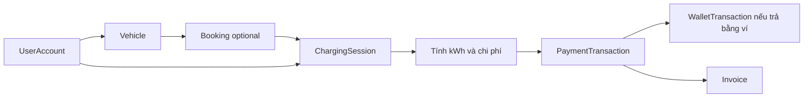
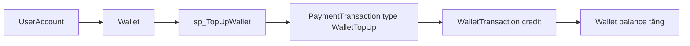
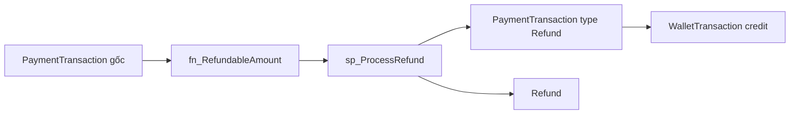
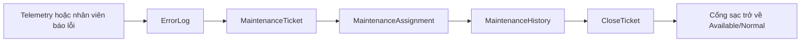
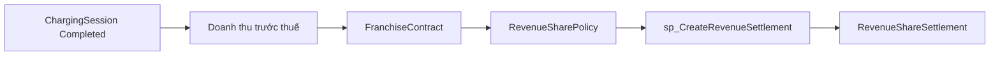

# Database Analysts - EV_Charging_System

Tài liệu này giải thích database của hệ thống trạm sạc xe điện theo cách dễ đọc cho người không chuyên. Mục tiêu là khi mở file này, người đọc hiểu được:

- Database đang lưu những loại dữ liệu nào.
- Các bảng liên kết với nhau ra sao.
- Hệ thống xử lý những nghiệp vụ nào.
- Người dùng, nhân viên, quản lý kinh doanh và admin được phân quyền thế nào.
- Các script SQL trong thư mục `database` dùng để làm gì.

## 1. Hệ thống này làm gì?

`EV_Charging_System` là database cho một hệ thống quản lý trạm sạc xe điện có yếu tố nhượng quyền. Có thể hiểu hệ thống gồm 5 nhóm người/vai trò chính:

| Nhóm | Họ làm gì trong hệ thống |
|---|---|
| Khách hàng | Đăng ký tài khoản, lưu thông tin xe, tìm trạm/cổng sạc, đặt lịch, sạc xe, thanh toán, xem lịch sử. |
| Nhân viên vận hành | Quản lý trạm sạc, cổng sạc, trạng thái thiết bị, phiên sạc, lỗi và bảo trì. |
| Quản lý kinh doanh | Theo dõi doanh thu, thanh toán, hoàn tiền, hợp đồng nhượng quyền và chia lợi nhuận. |
| Đối tác nhượng quyền | Sở hữu/vận hành một nhóm trạm, có hợp đồng và tỷ lệ chia doanh thu. |
| Quản trị hệ thống | Quản lý toàn bộ dữ liệu, tài khoản, phân quyền, cấu hình và audit log. |

Nói ngắn gọn: database này không chỉ lưu "trạm sạc ở đâu", mà còn theo dõi toàn bộ vòng đời từ khách hàng sạc xe, phát sinh tiền, thanh toán, xuất hóa đơn, chia doanh thu cho đối tác, đến xử lý lỗi và bảo trì thiết bị.

## 2. Cách tổ chức database

Database được chia thành các `schema`. Schema giống như các "ngăn hồ sơ" để nhóm bảng theo nghiệp vụ.

| Schema | Vai trò |
|---|---|
| `Core` | Dữ liệu nền tảng: quốc gia, khu vực, địa chỉ. |
| `Identity` | Tài khoản, hồ sơ khách hàng/nhân viên, role và permission. |
| `Infrastructure` | Trạm sạc, cổng sạc, loại đầu sạc, nhà cung cấp điện, telemetry. |
| `Operations` | Xe, đặt lịch, phiên sạc, giá sạc, sự kiện phiên sạc. |
| `Payments` | Ví, phương thức thanh toán, giao dịch, QR, hóa đơn, hoàn tiền. |
| `Franchise` | Đối tác nhượng quyền, hợp đồng, chính sách chia doanh thu, settlement. |
| `Maintenance` | Danh mục lỗi, log lỗi, ticket bảo trì, phân công và lịch sử xử lý. |
| `Reporting` | View và stored procedure để xem báo cáo. |
| `Audit` | Nhật ký thay đổi quan trọng trong hệ thống. |

## 3. ERD tổng quan

Sơ đồ dưới đây là bản ERD ở mức tổng quan. Ký hiệu đọc nhanh:

- `||--o{` nghĩa là một bản ghi bên trái có thể liên kết với nhiều bản ghi bên phải.
- `||--o|` nghĩa là một bản ghi bên trái có thể có tối đa một bản ghi bên phải.
- `}o--||` nghĩa là bảng bên trái là phía "nhiều", bảng bên phải là phía "một".

```mermaid
erDiagram
    CORE_COUNTRY ||--o{ CORE_REGION : contains
    CORE_REGION ||--o{ CORE_ADDRESS : has
    CORE_REGION ||--o{ IDENTITY_STAFF_PROFILE : manages
    CORE_REGION ||--o{ INFRA_ELECTRICITY_SUPPLIER : supplies

    IDENTITY_USER_ACCOUNT ||--o{ IDENTITY_USER_ROLE : has
    IDENTITY_ROLE ||--o{ IDENTITY_USER_ROLE : assigned_to
    IDENTITY_ROLE ||--o{ IDENTITY_ROLE_PERMISSION : grants
    IDENTITY_PERMISSION ||--o{ IDENTITY_ROLE_PERMISSION : belongs_to
    IDENTITY_USER_ACCOUNT ||--o| IDENTITY_CUSTOMER_PROFILE : customer_profile
    IDENTITY_USER_ACCOUNT ||--o| IDENTITY_STAFF_PROFILE : staff_profile

    CORE_ADDRESS ||--o{ FRANCHISE_PARTNER : registered_at
    IDENTITY_USER_ACCOUNT ||--o{ FRANCHISE_PARTNER : contact_user
    FRANCHISE_PARTNER ||--o{ FRANCHISE_CONTRACT : signs
    FRANCHISE_PARTNER ||--o{ INFRA_CHARGING_STATION : owns
    FRANCHISE_PARTNER ||--o{ FRANCHISE_SETTLEMENT : receives
    FRANCHISE_CONTRACT ||--o{ FRANCHISE_STATION : assigns
    FRANCHISE_CONTRACT ||--o{ FRANCHISE_REVENUE_SHARE_POLICY : defines
    FRANCHISE_CONTRACT ||--o{ FRANCHISE_SETTLEMENT : settles
    FRANCHISE_PARTNER ||--o{ FRANCHISE_STATION : maps

    CORE_ADDRESS ||--o{ INFRA_CHARGING_STATION : located_at
    INFRA_ELECTRICITY_SUPPLIER ||--o{ INFRA_CHARGING_STATION : powers
    IDENTITY_USER_ACCOUNT ||--o{ INFRA_CHARGING_STATION : operates
    INFRA_CHARGING_STATION ||--o{ INFRA_CHARGING_POINT : contains
    INFRA_CONNECTOR_TYPE ||--o{ INFRA_CHARGING_POINT : type
    INFRA_CHARGING_STATION ||--o{ INFRA_STATION_CONNECTOR_TYPE : supports
    INFRA_CONNECTOR_TYPE ||--o{ INFRA_STATION_CONNECTOR_TYPE : supported_by
    INFRA_CHARGING_POINT ||--o{ INFRA_POINT_STATUS_HISTORY : status_changes
    INFRA_CHARGING_POINT ||--o{ INFRA_POINT_TELEMETRY : reports

    IDENTITY_USER_ACCOUNT ||--o{ OPS_VEHICLE : owns
    INFRA_CONNECTOR_TYPE ||--o{ OPS_VEHICLE : preferred_connector
    IDENTITY_USER_ACCOUNT ||--o{ OPS_BOOKING : creates
    OPS_VEHICLE ||--o{ OPS_BOOKING : used_for
    INFRA_CHARGING_STATION ||--o{ OPS_BOOKING : booked_at
    INFRA_CHARGING_POINT ||--o{ OPS_BOOKING : reserves
    IDENTITY_USER_ACCOUNT ||--o{ OPS_CHARGING_SESSION : starts
    OPS_VEHICLE ||--o{ OPS_CHARGING_SESSION : charged_vehicle
    INFRA_CHARGING_STATION ||--o{ OPS_CHARGING_SESSION : happens_at
    INFRA_CHARGING_POINT ||--o{ OPS_CHARGING_SESSION : uses
    OPS_PRICING_POLICY ||--o{ OPS_CHARGING_SESSION : prices
    OPS_BOOKING ||--o| OPS_CHARGING_SESSION : becomes
    OPS_CHARGING_SESSION ||--o{ OPS_SESSION_EVENT : logs

    IDENTITY_USER_ACCOUNT ||--o| PAY_WALLET : owns
    PAY_PAYMENT_METHOD ||--o{ PAY_PAYMENT_TRANSACTION : used_by
    IDENTITY_USER_ACCOUNT ||--o{ PAY_PAYMENT_TRANSACTION : pays
    OPS_CHARGING_SESSION ||--o{ PAY_PAYMENT_TRANSACTION : paid_by
    PAY_WALLET ||--o{ PAY_WALLET_TRANSACTION : changes
    PAY_PAYMENT_TRANSACTION ||--o{ PAY_WALLET_TRANSACTION : reflected_in
    IDENTITY_USER_ACCOUNT ||--o{ PAY_QR_PAYMENT_REQUEST : requests
    OPS_CHARGING_SESSION ||--o{ PAY_QR_PAYMENT_REQUEST : for_session
    PAY_PAYMENT_TRANSACTION ||--o| PAY_QR_PAYMENT_REQUEST : completes
    IDENTITY_USER_ACCOUNT ||--o{ PAY_INVOICE : receives
    OPS_CHARGING_SESSION ||--o| PAY_INVOICE : invoiced
    PAY_PAYMENT_TRANSACTION ||--o| PAY_INVOICE : pays_invoice
    PAY_PAYMENT_TRANSACTION ||--o{ PAY_REFUND : original_payment
    PAY_PAYMENT_TRANSACTION ||--o{ PAY_REFUND : refund_payment
    IDENTITY_USER_ACCOUNT ||--o{ PAY_REFUND : refunded_user

    MAINT_ERROR_CATALOG ||--o{ MAINT_ERROR_LOG : classifies
    INFRA_CHARGING_STATION ||--o{ MAINT_ERROR_LOG : station_error
    INFRA_CHARGING_POINT ||--o{ MAINT_ERROR_LOG : point_error
    MAINT_ERROR_LOG ||--o{ MAINT_TICKET : creates
    INFRA_CHARGING_STATION ||--o{ MAINT_TICKET : station_ticket
    INFRA_CHARGING_POINT ||--o{ MAINT_TICKET : point_ticket
    IDENTITY_USER_ACCOUNT ||--o{ MAINT_TICKET : created_by
    MAINT_TICKET ||--o{ MAINT_ASSIGNMENT : assigned
    IDENTITY_USER_ACCOUNT ||--o{ MAINT_ASSIGNMENT : technician
    MAINT_TICKET ||--o{ MAINT_HISTORY : status_history
    IDENTITY_USER_ACCOUNT ||--o{ MAINT_HISTORY : changed_by
```

## 4. Các bảng chính và ý nghĩa

### 4.1. `Core`: dữ liệu địa lý

| Bảng | Ý nghĩa | Cột quan trọng |
|---|---|---|
| `Core.Country` | Quốc gia mà hệ thống hoạt động. | `CountryCode`, `CountryName`, `CurrencyCode`, `PhonePrefix`. |
| `Core.Region` | Tỉnh/thành/khu vực trong một quốc gia. | `CountryID`, `RegionCode`, `RegionName`, `TimeZone`. |
| `Core.Address` | Địa chỉ cụ thể của trạm, đối tác hoặc điểm liên hệ. | `RegionID`, `StreetAddress`, `Ward`, `District`, `Latitude`, `Longitude`, `FullAddress`. |

Điểm đáng chú ý:

- `Address.FullAddress` là cột tính tự động từ đường, phường/xã và quận/huyện.
- Latitude/longitude có ràng buộc để không nhập tọa độ sai ngoài phạm vi trái đất.

### 4.2. `Identity`: tài khoản và phân quyền nghiệp vụ

| Bảng | Ý nghĩa | Cột quan trọng |
|---|---|---|
| `Identity.UserAccount` | Tài khoản đăng nhập chung cho admin, nhân viên, quản lý và khách hàng. | `Username`, `Email`, `Phone`, `PasswordHash`, `FullName`, `AccountStatus`. |
| `Identity.Role` | Danh sách vai trò nghiệp vụ. | `RoleCode`, `RoleName`, `Description`. |
| `Identity.Permission` | Danh sách quyền theo module. | `PermissionCode`, `PermissionName`, `ModuleName`. |
| `Identity.RolePermission` | Bảng nối role với permission. | `RoleID`, `PermissionID`. |
| `Identity.UserRole` | Bảng nối user với role. | `UserID`, `RoleID`, `AssignedAt`. |
| `Identity.CustomerProfile` | Hồ sơ riêng của khách hàng. | `UserID`, `LoyaltyLevel`, `TotalRewardPoints`. |
| `Identity.StaffProfile` | Hồ sơ riêng của nhân viên. | `UserID`, `EmployeeCode`, `Department`, `ManagedRegionID`. |

Database dùng 2 lớp phân quyền:

1. Lớp nghiệp vụ trong bảng `Identity.Role`, `Identity.Permission`, `Identity.RolePermission`.
2. Lớp quyền SQL Server trong file `08_Create_Security.sql`, gồm các database role như `db_ev_customer`, `db_ev_business_manager`.

### 4.3. `Infrastructure`: hạ tầng trạm sạc

| Bảng | Ý nghĩa | Cột quan trọng |
|---|---|---|
| `Infrastructure.ElectricitySupplier` | Nhà cung cấp điện theo khu vực. | `SupplierCode`, `SupplierName`, `RegionID`, `UnitPricePerKWh`. |
| `Infrastructure.ChargingStation` | Trạm sạc. | `StationCode`, `StationName`, `FranchiseID`, `AddressID`, `SupplierID`, `StationOperatorID`, `MaxPowerKW`, `StationStatus`. |
| `Infrastructure.ConnectorType` | Loại đầu sạc. | `ConnectorCode`, `ConnectorName`, `MaxPowerKW`. |
| `Infrastructure.StationConnectorType` | Bảng nối cho biết trạm hỗ trợ những loại đầu sạc nào. | `StationID`, `ConnectorTypeID`. |
| `Infrastructure.ChargingPoint` | Cổng sạc cụ thể trong trạm. | `PointCode`, `StationID`, `ConnectorTypeID`, `PowerKW`, `SerialNumber`, `PointStatus`, `HealthStatus`. |
| `Infrastructure.PointStatusHistory` | Lịch sử đổi trạng thái cổng sạc. | `PointID`, `OldStatus`, `NewStatus`, `ChangedAt`. |
| `Infrastructure.PointTelemetry` | Dữ liệu đo từ thiết bị. | `PointID`, `Voltage`, `CurrentAmp`, `TemperatureC`, `PowerKW`, `HealthStatus`, `RecordedAt`. |

Trạng thái cổng sạc (`PointStatus`) gồm: `Available`, `Reserved`, `Charging`, `Offline`, `Error`, `Maintenance`, `Retired`.

Trạng thái sức khỏe (`HealthStatus`) gồm: `Normal`, `Warning`, `Critical`, `Offline`.

### 4.4. `Operations`: đặt lịch và phiên sạc

| Bảng | Ý nghĩa | Cột quan trọng |
|---|---|---|
| `Operations.Vehicle` | Xe của khách hàng. | `UserID`, `PlateNumber`, `Brand`, `Model`, `BatteryCapacityKWh`, `PreferredConnectorTypeID`. |
| `Operations.PricingPolicy` | Chính sách giá sạc. | `BasePricePerKWh`, `PeakMultiplier`, `PeakStartHour`, `PeakEndHour`, `AppliedFrom`, `AppliedTo`. |
| `Operations.Booking` | Lịch đặt trước một cổng sạc. | `UserID`, `VehicleID`, `StationID`, `PointID`, `BookedFrom`, `BookedTo`, `BookingStatus`. |
| `Operations.ChargingSession` | Phiên sạc thực tế. | `UserID`, `VehicleID`, `StationID`, `PointID`, `PolicyID`, `StartTime`, `EndTime`, `TotalKWh`, `CostTotal`, `SessionStatus`. |
| `Operations.SessionEvent` | Nhật ký sự kiện trong phiên sạc. | `SessionID`, `EventType`, `EventPayload`, `CreatedAt`. |

Phiên sạc là bảng trung tâm của nghiệp vụ vận hành. Khi khách sạc xe:

1. Hệ thống kiểm tra cổng sạc có `Available` không.
2. Tạo `ChargingSession` với trạng thái `Charging`.
3. Đổi `ChargingPoint.PointStatus` thành `Charging`.
4. Khi kết thúc, tính số kWh, thời lượng, tiền trước thuế, thuế và tổng tiền.
5. Đổi cổng sạc về `Available`.
6. Sau đó mới tạo thanh toán và hóa đơn.

### 4.5. `Payments`: ví, giao dịch, QR, hóa đơn và hoàn tiền

| Bảng | Ý nghĩa | Cột quan trọng |
|---|---|---|
| `Payments.PaymentMethod` | Phương thức thanh toán. | `MethodCode`, `MethodName`, `IsOnline`, `IsActive`. |
| `Payments.Wallet` | Ví nội bộ của người dùng. | `UserID`, `WalletCode`, `Balance`, `CurrencyCode`. |
| `Payments.WalletTransaction` | Lịch sử biến động số dư ví. | `WalletID`, `TransactionID`, `Amount`, `BalanceBefore`, `BalanceAfter`, `Direction`. |
| `Payments.PaymentTransaction` | Giao dịch thanh toán chính. | `UserID`, `SessionID`, `PaymentMethodID`, `TransactionType`, `Direction`, `Amount`, `TransactionStatus`. |
| `Payments.QRPaymentRequest` | Yêu cầu thanh toán bằng QR. | `RequestCode`, `UserID`, `SessionID`, `Amount`, `QRPayload`, `RequestStatus`, `ExpiresAt`. |
| `Payments.Invoice` | Hóa đơn cho phiên sạc. | `InvoiceCode`, `UserID`, `SessionID`, `TransactionID`, `Subtotal`, `TaxAmount`, `TotalAmount`, `InvoiceStatus`. |
| `Payments.Refund` | Hoàn tiền cho một giao dịch gốc. | `OriginalTransactionID`, `RefundTransactionID`, `UserID`, `Amount`, `RefundStatus`. |

`Direction` trong giao dịch:

| Giá trị | Ý nghĩa |
|---|---|
| `D` | Debit, tiền đi ra khỏi ví/người dùng phải trả. |
| `C` | Credit, tiền đi vào ví/người dùng được cộng tiền. |

`TransactionType` gồm: `ChargingPayment`, `WalletTopUp`, `Refund`, `SettlementPayout`.

### 4.6. `Franchise`: nhượng quyền và chia doanh thu

| Bảng | Ý nghĩa | Cột quan trọng |
|---|---|---|
| `Franchise.FranchisePartner` | Đối tác nhượng quyền. | `FranchiseCode`, `FranchiseName`, `TaxCode`, `AddressID`, `ContactUserID`, `PartnerStatus`. |
| `Franchise.FranchiseContract` | Hợp đồng với đối tác. | `FranchiseID`, `ContractCode`, `StartDate`, `EndDate`, `BaseRevenueShareRate`, `ContractStatus`. |
| `Franchise.FranchiseStation` | Bảng nối trạm với hợp đồng nhượng quyền. | `FranchiseID`, `StationID`, `ContractID`. |
| `Franchise.RevenueSharePolicy` | Chính sách tỷ lệ chia doanh thu theo hợp đồng. | `ContractID`, `PartnerShareRate`, `PlatformShareRate`, `AppliedFrom`, `AppliedTo`. |
| `Franchise.RevenueShareSettlement` | Kết quả chốt doanh thu theo kỳ. | `FranchiseID`, `ContractID`, `PeriodStart`, `PeriodEnd`, `GrossRevenue`, `PartnerShareAmount`, `PlatformShareAmount`, `SettlementStatus`. |

Ví dụ: nếu đối tác có tỷ lệ chia 72%, một kỳ có doanh thu trước thuế 10.000.000 VND thì:

- Đối tác nhận 7.200.000 VND.
- Nền tảng giữ 2.800.000 VND.

### 4.7. `Maintenance`: lỗi và bảo trì

| Bảng | Ý nghĩa | Cột quan trọng |
|---|---|---|
| `Maintenance.ErrorCatalog` | Danh mục lỗi chuẩn. | `ErrorCode`, `ErrorName`, `DefaultSeverity`, `Description`. |
| `Maintenance.ErrorLog` | Lỗi phát sinh thực tế ở trạm/cổng sạc. | `ErrorCode`, `StationID`, `PointID`, `Severity`, `Description`, `OccurredAt`, `ResolvedAt`, `IsActive`. |
| `Maintenance.MaintenanceTicket` | Phiếu xử lý bảo trì. | `StationID`, `PointID`, `ErrorID`, `CreatedBy`, `Priority`, `TicketStatus`, `Title`. |
| `Maintenance.MaintenanceAssignment` | Phân công kỹ thuật viên cho ticket. | `TicketID`, `TechnicianUserID`, `AssignedBy`, `AssignedAt`. |
| `Maintenance.MaintenanceHistory` | Lịch sử đổi trạng thái ticket. | `TicketID`, `OldStatus`, `NewStatus`, `Notes`, `ChangedBy`. |

Khi báo lỗi bằng procedure `Maintenance.sp_ReportError`, database tự:

1. Tìm mức độ nghiêm trọng mặc định trong `ErrorCatalog`.
2. Ghi lỗi vào `ErrorLog`.
3. Tạo `MaintenanceTicket`.
4. Nếu lỗi gắn với cổng sạc, đổi cổng sang `Error` và `Critical`.

### 4.8. `Reporting`: báo cáo

`Reporting` không lưu bảng dữ liệu nghiệp vụ chính, mà tạo view/procedure để đọc dữ liệu dễ hơn.

| View/Procedure | Dùng để làm gì |
|---|---|
| `Reporting.vw_CustomerChargingHistory` | Xem lịch sử sạc: khách hàng, xe, trạm, cổng, kWh, chi phí. |
| `Reporting.vw_StationRevenueDaily` | Doanh thu theo ngày của từng trạm. |
| `Reporting.vw_FranchiseRevenueMonthly` | Doanh thu theo tháng của từng đối tác nhượng quyền. |
| `Reporting.vw_ProfitSharing` | Kết quả chia doanh thu giữa đối tác và nền tảng. |
| `Reporting.vw_ConnectorUtilization` | Mức sử dụng theo loại đầu sạc. |
| `Reporting.vw_MaintenanceKPI` | KPI bảo trì: số ticket, lỗi còn mở, thời gian xử lý trung bình. |
| `Reporting.vw_PaymentSummary` | Tổng hợp giao dịch theo phương thức, loại giao dịch, trạng thái. |
| `Reporting.sp_ReportStationRevenue` | Báo cáo doanh thu trạm trong khoảng ngày. |
| `Reporting.sp_ReportFranchiseProfit` | Báo cáo chia lợi nhuận nhượng quyền. |
| `Reporting.sp_ReportOperationalKPI` | Báo cáo vận hành và bảo trì. |
| `Reporting.sp_ReportPaymentRefund` | Báo cáo thanh toán và hoàn tiền. |
| `Reporting.sp_ReportCustomerUsage` | Top khách hàng theo số phiên sạc/kWh/chi tiêu. |
| `Reporting.sp_ReportTelemetryHealth` | Báo cáo cổng sạc có tín hiệu telemetry bất thường. |

### 4.9. `Audit`: nhật ký thay đổi

| Bảng | Ý nghĩa | Cột quan trọng |
|---|---|---|
| `Audit.AuditLog` | Ghi lại thay đổi quan trọng như insert/update/payment/refund/settlement/security. | `SchemaName`, `TableName`, `RecordID`, `ActionType`, `OldValues`, `NewValues`, `ChangedBy`, `ChangedAt`. |

Điểm quan trọng: trigger `Audit.trg_AuditLog_BlockDelete` chặn xóa audit log. Điều này giúp dữ liệu audit khó bị xóa nhầm hoặc bị che giấu sau khi có sự cố.

## 5. Bảng quan hệ chính

| Quan hệ | Ý nghĩa nghiệp vụ |
|---|---|
| `Country` 1-n `Region` | Một quốc gia có nhiều khu vực. |
| `Region` 1-n `Address` | Một khu vực có nhiều địa chỉ. |
| `UserAccount` n-n `Role` qua `UserRole` | Một user có thể có nhiều vai trò, một vai trò có thể gán cho nhiều user. |
| `Role` n-n `Permission` qua `RolePermission` | Một role có nhiều quyền, một quyền có thể nằm trong nhiều role. |
| `UserAccount` 1-1 `CustomerProfile` | User là khách hàng có hồ sơ khách hàng riêng. |
| `UserAccount` 1-1 `StaffProfile` | User là nhân viên có hồ sơ nhân viên riêng. |
| `FranchisePartner` 1-n `FranchiseContract` | Một đối tác có thể ký nhiều hợp đồng theo thời gian. |
| `FranchisePartner` 1-n `ChargingStation` | Một đối tác sở hữu/vận hành nhiều trạm. |
| `ChargingStation` 1-n `ChargingPoint` | Một trạm có nhiều cổng sạc. |
| `ConnectorType` 1-n `ChargingPoint` | Một loại đầu sạc có thể dùng ở nhiều cổng. |
| `ChargingStation` n-n `ConnectorType` qua `StationConnectorType` | Một trạm hỗ trợ nhiều loại đầu sạc, một loại đầu sạc có ở nhiều trạm. |
| `UserAccount` 1-n `Vehicle` | Một khách hàng có thể lưu nhiều xe. |
| `UserAccount` 1-n `Booking` | Một khách hàng có thể đặt nhiều lịch sạc. |
| `Booking` 0/1-1 `ChargingSession` | Một booking có thể trở thành một phiên sạc thực tế. |
| `ChargingSession` 1-n `SessionEvent` | Một phiên sạc có nhiều sự kiện như started/completed. |
| `PricingPolicy` 1-n `ChargingSession` | Một chính sách giá được áp dụng cho nhiều phiên sạc. |
| `ChargingSession` 0/1-n `PaymentTransaction` | Một phiên sạc có thể có giao dịch thanh toán, hoặc giao dịch hoàn tiền liên quan. |
| `UserAccount` 1-1 `Wallet` | Mỗi user có một ví nội bộ. |
| `Wallet` 1-n `WalletTransaction` | Mỗi thay đổi số dư ví được ghi lại thành một dòng lịch sử. |
| `PaymentTransaction` 0/1-1 `Invoice` | Một giao dịch thanh toán có thể gắn với một hóa đơn. |
| `PaymentTransaction` 1-n `Refund` | Một giao dịch gốc có thể được hoàn tiền một hoặc nhiều lần. |
| `ErrorCatalog` 1-n `ErrorLog` | Một loại lỗi chuẩn có thể phát sinh nhiều lần. |
| `ErrorLog` 0/1-1/n `MaintenanceTicket` | Một lỗi có thể tạo ticket bảo trì. |
| `MaintenanceTicket` 1-n `MaintenanceAssignment` | Một ticket có thể được phân công nhiều lần. |
| `MaintenanceTicket` 1-n `MaintenanceHistory` | Mọi lần đổi trạng thái ticket được lưu lại. |
| `FranchiseContract` 1-n `RevenueSharePolicy` | Một hợp đồng có thể có nhiều chính sách chia doanh thu theo thời gian. |
| `FranchisePartner` 1-n `RevenueShareSettlement` | Mỗi đối tác có nhiều kỳ chốt doanh thu. |

## 6. Luồng nghiệp vụ dễ hiểu

### 6.1. Khách hàng sạc xe và thanh toán

Diễn giải:

1. Khách hàng có tài khoản trong `UserAccount`.
2. Khách hàng lưu xe trong `Vehicle`.
3. Có thể đặt lịch trước trong `Booking`.
4. Khi bắt đầu sạc, tạo `ChargingSession`.
5. Khi kết thúc sạc, database tính kWh, tiền sạc, thuế và tổng tiền.
6. Khách hàng thanh toán qua ví hoặc QR.
7. Hệ thống tạo hóa đơn.

### 6.2. Nạp ví

### 6.3. Hoàn tiền

Database kiểm tra số tiền còn được hoàn bằng `Payments.fn_RefundableAmount`. Nếu hoàn quá số tiền gốc còn lại, procedure sẽ lỗi và rollback.

### 6.4. Báo lỗi và bảo trì

### 6.5. Chia doanh thu nhượng quyền

Settlement dùng doanh thu trước thuế (`CostBeforeTax`) của các phiên sạc đã hoàn tất trong kỳ, sau đó chia theo `PartnerShareRate`.

## 7. Stored procedure và function quan trọng

### 7.1. Function

| Function | Ý nghĩa |
|---|---|
| `Operations.fn_CalculateChargingCost` | Tính tiền sạc theo kWh, chính sách giá và giờ cao điểm. |
| `Franchise.fn_CalculatePartnerShare` | Tính số tiền đối tác được hưởng theo tỷ lệ phần trăm. |
| `Reporting.fn_PointUtilizationRate` | Tính tỷ lệ sử dụng của một cổng sạc trong khoảng thời gian. |
| `Payments.fn_RefundableAmount` | Tính số tiền còn có thể hoàn của một giao dịch thanh toán. |

### 7.2. Stored procedure

| Procedure | Ý nghĩa |
|---|---|
| `Identity.sp_CreateUser` | Tạo user, gán role, tự tạo profile và ví nếu là khách hàng. |
| `Infrastructure.sp_CreateChargingStation` | Tạo trạm sạc mới và ghi audit. |
| `Infrastructure.sp_CreateChargingPoint` | Tạo cổng sạc mới, tự thêm loại đầu sạc vào danh sách hỗ trợ của trạm nếu chưa có. |
| `Operations.sp_StartChargingSession` | Bắt đầu phiên sạc, kiểm tra cổng rảnh, chọn chính sách giá, đổi cổng sang `Charging`. |
| `Operations.sp_EndChargingSession` | Kết thúc phiên sạc, tính kWh, tiền, thuế, đổi cổng về `Available`. |
| `Payments.sp_TopUpWallet` | Nạp tiền ví, tạo giao dịch và lịch sử ví. |
| `Payments.sp_CreatePayment` | Thanh toán phiên sạc, trừ ví nếu dùng `WALLET`, ghi audit. |
| `Payments.sp_CreateInvoice` | Tạo hóa đơn cho phiên sạc đã hoàn tất. |
| `Payments.sp_ProcessRefund` | Hoàn tiền, cộng ví, tạo giao dịch refund, ghi audit. |
| `Maintenance.sp_ReportError` | Ghi lỗi, tự tạo ticket, đổi trạng thái cổng lỗi. |
| `Maintenance.sp_AssignTicket` | Phân công kỹ thuật viên và ghi lịch sử ticket. |
| `Maintenance.sp_CloseTicket` | Đóng ticket, resolve lỗi, đưa cổng sạc về bình thường. |
| `Franchise.sp_CreateRevenueSettlement` | Chốt doanh thu và tính phần chia cho đối tác/nền tảng. |

## 8. Trigger tự động

| Trigger | Khi nào chạy | Tác dụng |
|---|---|---|
| `Infrastructure.trg_ChargingPoint_StatusHistory` | Khi `ChargingPoint` đổi trạng thái. | Ghi vào `PointStatusHistory` và `AuditLog`. |
| `Operations.trg_ChargingSession_Audit` | Khi thêm/cập nhật `ChargingSession`. | Ghi audit cho trạng thái phiên sạc. |
| `Payments.trg_PaymentTransaction_Audit` | Khi thêm/cập nhật `PaymentTransaction`. | Ghi audit cho thanh toán. |
| `Audit.trg_AuditLog_BlockDelete` | Khi có lệnh xóa `AuditLog`. | Chặn xóa audit log. |

## 9. Phân quyền

Database có 4 role SQL Server chính trong `08_Create_Security.sql`.

| Role SQL | Tương ứng nghiệp vụ | Được phép |
|---|---|---|
| `db_ev_system_admin` | `SystemAdmin` | `SELECT`, `INSERT`, `UPDATE`, `DELETE` trên tất cả schema chính, được `EXECUTE` toàn database. |
| `db_ev_operations_staff` | `OperationsStaff` | Xem/thêm/sửa dữ liệu `Infrastructure`, `Operations`, `Maintenance`; xem `Reporting`; chạy procedure vận hành, trạm, bảo trì và báo cáo KPI/telemetry. |
| `db_ev_business_manager` | `BusinessManager` | Xem `Franchise`, `Payments`, `Reporting`; chạy procedure tạo settlement, thanh toán, hóa đơn, hoàn tiền và báo cáo tài chính. |
| `db_ev_customer` | `Customer` | Xem view lịch sử sạc, chạy báo cáo usage, bắt đầu/kết thúc phiên sạc, nạp ví, thanh toán, tạo hóa đơn. |

Các giới hạn quan trọng:

| Role | Bị chặn |
|---|---|
| `db_ev_operations_staff` | Không được đọc/sửa `Payments` và `Identity`. Nhân viên vận hành không xem bảng thanh toán thô hoặc thông tin tài khoản nhạy cảm. |
| `db_ev_business_manager` | Không được đọc `Identity`; không được ghi vào `Infrastructure`, `Operations`, `Maintenance`. Quản lý kinh doanh xem tiền và hợp đồng, nhưng không tự sửa trạm hoặc phiên sạc. |
| `db_ev_customer` | Không được đọc/sửa trực tiếp `Payments` và `Identity`. Khách hàng đi qua procedure/view thay vì đọc bảng thô. |

Lưu ý triển khai thật:

- `Reporting.vw_CustomerChargingHistory` hiện là view tổng hợp lịch sử sạc. Trong demo, khách hàng được test quyền đọc view này. Nếu dùng production, nên lọc theo user đăng nhập ở backend hoặc bổ sung Row-Level Security để khách chỉ thấy dữ liệu của chính mình.
- Password trong seed data là hash demo, không nên dùng làm chuẩn bảo mật production.

## 10. Quy tắc dữ liệu và chất lượng thiết kế

Database có nhiều ràng buộc để hạn chế dữ liệu sai:

| Nhóm ràng buộc | Ví dụ |
|---|---|
| Unique | Username, email, phone, mã trạm, mã cổng sạc, mã giao dịch, mã hóa đơn không được trùng. |
| Check status | Trạng thái user, trạm, cổng, booking, session, payment, refund, ticket chỉ được nằm trong danh sách cho phép. |
| Check số tiền | Số tiền, giá/kWh, doanh thu, tỷ lệ chia phải không âm hoặc nằm trong khoảng hợp lệ. |
| Check thời gian | Booking phải có `BookedFrom < BookedTo`; hợp đồng phải `StartDate < EndDate`; session không được kết thúc trước khi bắt đầu. |
| Foreign key | Không thể tạo phiên sạc cho user/trạm/cổng không tồn tại. |
| Computed column | `Address.FullAddress`, `WalletTransaction.BalanceAfter`, `RevenueSharePolicy.PlatformShareRate` được tính tự động. |

Database cũng tạo index cho các truy vấn thường gặp:

- Tìm lịch sử sạc theo user và thời gian.
- Tìm phiên sạc theo trạm/cổng/trạng thái.
- Tìm giao dịch theo user, session, trạng thái.
- Xem telemetry mới nhất theo cổng sạc.
- Xem ticket bảo trì theo trạng thái và mức ưu tiên.
- Xem settlement theo đối tác và kỳ.

## 11. Dữ liệu demo đang mô phỏng gì?

File `09_Seed_Demo_Data.sql` tạo dữ liệu mẫu cho một kịch bản có thể demo trong SSMS:

| Nhóm dữ liệu | Nội dung mẫu |
|---|---|
| Địa lý | Việt Nam, TP. Hồ Chí Minh, Hà Nội, Đà Nẵng, nhiều địa chỉ trạm. |
| Người dùng | `admin01`, `operator01`, `business01`, `customer01` đến `customer05`. |
| Role/permission | 4 role chính và các quyền module. |
| Đối tác | VinFast Sài Gòn, EVN Đà Nẵng. |
| Hợp đồng | Hợp đồng nhượng quyền năm 2026 với tỷ lệ chia doanh thu. |
| Trạm/cổng | 5 trạm sạc, mỗi trạm nhiều cổng, hỗ trợ CCS2, CHAdeMO, Type2. |
| Giá sạc | Giá chuẩn 2026 và giá đêm khuyến khích. |
| Phiên sạc | 40 phiên sạc hoàn tất để có dữ liệu doanh thu. |
| Thanh toán | Giao dịch ví, QR, hóa đơn, một giao dịch hoàn tiền mẫu. |
| Bảo trì | Telemetry, lỗi nhiệt độ, ticket và phân công kỹ thuật viên. |
| Settlement | Chốt doanh thu tháng 05/2026 cho đối tác. |

## 12. Các file SQL nên biết

| File | Vai trò |
|---|---|
| `database/run_all.sql` | Chạy toàn bộ quá trình dựng database theo đúng thứ tự. |
| `database/00_Drop_And_Create_Database.sql` | Xóa và tạo lại database `EV_Charging_System`. |
| `database/01_Create_Schemas.sql` | Tạo các schema. |
| `database/02_Create_Tables.sql` | Tạo toàn bộ bảng và khóa ngoại. |
| `database/03_Create_Constraints_Indexes.sql` | Tạo index để tăng tốc truy vấn. |
| `database/04_Create_Functions.sql` | Tạo function tính tiền, hoàn tiền, utilization, chia doanh thu. |
| `database/05_Create_Stored_Procedures.sql` | Tạo procedure xử lý nghiệp vụ chính. |
| `database/06_Create_Triggers.sql` | Tạo trigger audit và lịch sử trạng thái. |
| `database/07_Create_Reporting.sql` | Tạo view và procedure báo cáo. |
| `database/08_Create_Security.sql` | Tạo role SQL Server, user demo và grant/deny quyền. |
| `database/09_Seed_Demo_Data.sql` | Tạo dữ liệu mẫu để demo. |
| `database/10_Demo_Queries.sql` | Query demo dashboard, báo cáo và workflow sạc xe. |
| `database/11_Test_Roles.sql` | Test phân quyền bằng `EXECUTE AS USER`. |
| `database/12_Backup_Restore.sql` | Script tham khảo backup/restore. |

## 13. Câu chuyện database theo ngôn ngữ đời thường

Một khách hàng tên An có tài khoản trong `UserAccount`, có xe trong `Vehicle`, và có ví trong `Wallet`. An đến trạm `VFSG-01`, chọn cổng `P-1-A`. Khi bắt đầu sạc, hệ thống tạo một dòng trong `ChargingSession` và đổi cổng sang trạng thái `Charging`. Khi An dừng sạc, hệ thống tính tổng kWh, áp dụng chính sách giá trong `PricingPolicy`, cộng thuế và ra `CostTotal`.

An thanh toán bằng ví. Database tạo `PaymentTransaction`, trừ tiền trong `Wallet`, ghi lịch sử vào `WalletTransaction`, sau đó tạo `Invoice`. Vì trạm thuộc đối tác VinFast Sài Gòn, doanh thu phiên sạc này sẽ được tính vào kỳ settlement của đối tác trong `RevenueShareSettlement`.

Nếu cổng sạc bị nóng hoặc mất kết nối, hệ thống ghi `ErrorLog`, tạo `MaintenanceTicket`, phân công nhân viên trong `MaintenanceAssignment`, và lưu từng lần đổi trạng thái trong `MaintenanceHistory`. Những thay đổi quan trọng như trạng thái cổng, phiên sạc, thanh toán và hoàn tiền được ghi vào `AuditLog`.

## 14. Điểm mạnh của thiết kế hiện tại

- Tách schema rõ ràng theo nghiệp vụ, dễ đọc và dễ chấm trong SSMS.
- Có đủ vòng đời chính: user, xe, trạm, cổng, sạc, thanh toán, hóa đơn, hoàn tiền, nhượng quyền, bảo trì, báo cáo.
- Có stored procedure cho nghiệp vụ quan trọng, giúp xử lý theo transaction và rollback khi lỗi.
- Có audit log và trigger chặn xóa audit.
- Có role SQL Server để demo phân quyền thật, không chỉ mô tả lý thuyết.
- Có dữ liệu mẫu và query demo để trình bày trước giảng viên.

## 15. Những điểm cần lưu ý nếu phát triển production

- Cần bổ sung lọc dữ liệu theo user cho customer bằng backend hoặc Row-Level Security.
- Cần dùng password hash thật từ backend, không dùng hash demo trong seed.
- Cần tích hợp cổng thanh toán/QR thật thay vì payload demo.
- Cần bổ sung chính sách backup, retention audit log và monitoring vận hành.
- Cần cân nhắc soft delete cho một số bảng nghiệp vụ thay vì xóa trực tiếp.
- Cần kiểm soát quyền `EXECUTE` theo từng procedure nếu môi trường production có yêu cầu bảo mật cao hơn.

## 16. Tóm tắt một câu

Database này mô phỏng khá đầy đủ một nền tảng quản lý trạm sạc xe điện: từ tài khoản và phân quyền, vận hành thiết bị, phiên sạc, thanh toán, hóa đơn, hoàn tiền, chia doanh thu nhượng quyền, đến bảo trì và báo cáo.
