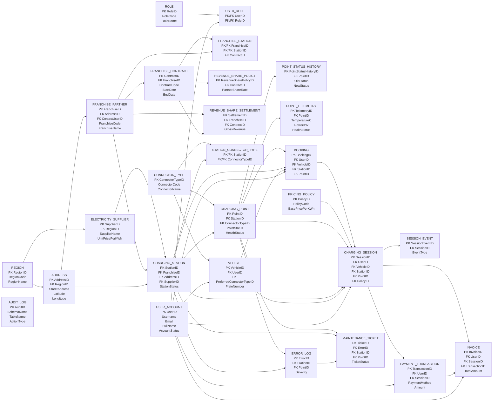
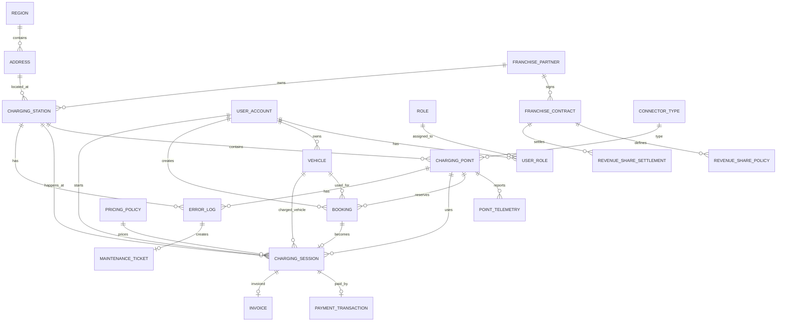
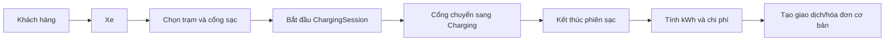
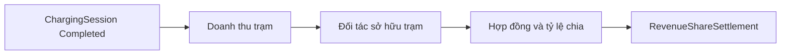
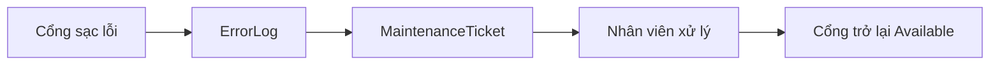

# Database Analysts - EV_Charging_System

Tài liệu này giải thích database của hệ thống quản lý trạm sạc xe điện theo hướng dễ đọc cho người không chuyên, đồng thời bám sát phạm vi đồ án: trọng tâm là quản lý trạm sạc, cổng sạc, phiên sạc, người dùng, phân quyền cơ bản, doanh thu và nhượng quyền.

Một số phần như thanh toán chi tiết, ví điện tử, hoàn tiền nhiều bước hoặc bảo trì chuyên sâu được xem là phần phụ trợ. Chúng có thể xuất hiện trong database để demo luồng đầy đủ, nhưng không nên được trình bày như trọng tâm chính của đồ án.

## 1. Phạm vi nghiệp vụ

Hệ thống mô phỏng một mạng lưới trạm sạc xe điện. Người dùng có thể có xe, chọn trạm/cổng sạc, bắt đầu sạc, kết thúc sạc và phát sinh chi phí. Nhân viên vận hành theo dõi trạng thái trạm/cổng. Quản lý kinh doanh theo dõi doanh thu và phần chia cho đối tác nhượng quyền.

| Nhóm | Vai trò chính |
|---|---|
| Khách hàng | Có tài khoản, xe, lịch sử sạc và hóa đơn cơ bản. |
| Nhân viên vận hành | Quản lý trạm, cổng sạc, trạng thái thiết bị và phiên sạc. |
| Quản lý kinh doanh | Xem doanh thu, hợp đồng nhượng quyền và kết quả chia doanh thu. |
| Quản trị hệ thống | Quản lý tài khoản, vai trò, dữ liệu hệ thống và audit. |
| Đối tác nhượng quyền | Gắn với trạm, hợp đồng và tỷ lệ chia doanh thu. |

## 2. Mức độ ưu tiên của các module

Không phải schema nào cũng quan trọng như nhau. Với đồ án quản lý thông tin, nên trình bày theo 3 mức:

Sau khi tinh gọn, database còn 27 bảng. Các bảng phục vụ ví điện tử, refund chi tiết, permission chi tiết và bảo trì nhiều bước đã được bỏ khỏi script chính.

| Mức | Module | Lý do |
|---|---|---|
| Lõi | `Infrastructure`, `Operations`, `Franchise`, `Reporting` | Đây là phần thể hiện rõ bài toán quản lý trạm sạc và nhượng quyền. |
| Cần có nhưng vừa đủ | `Identity`, `Core`, `Audit` | Cần để biết ai dùng hệ thống, ở đâu, ai được làm gì và có ghi nhận thay đổi. |
| Phụ trợ | `Payments`, `Maintenance` | Có ích để demo luồng hoàn chỉnh, nhưng không phải trọng tâm chính nên chỉ mô tả/tối giản. |

## 3. Thiết kế nên tinh gọn thế nào?

Các nhận xét thiết kế được phản ánh như sau:

| Phần | Nhận xét | Hướng trình bày/tinh gọn |
|---|---|---|
| `Core` | Không cần quản lý tới cấp quốc gia. | Đã giữ `Region` và `Address`, bỏ `Country`. |
| `Identity` | Nhiều bảng hơn mức cần thiết của đồ án. | Đã giữ `UserAccount`, `Role`, `UserRole`, bỏ permission/profile riêng. |
| `Infrastructure` | Thiết kế phù hợp. | Giữ làm phần trung tâm: trạm, cổng, loại đầu sạc, trạng thái, telemetry. |
| `Payments` | Không phải tính năng chính. | Chỉ cần ghi nhận giao dịch/hóa đơn cơ bản theo phiên sạc. Ví, QR, refund là mở rộng. |
| `Maintenance` | Không phải tính năng chính. | Chỉ cần ghi lỗi và ticket cơ bản. Phân công/lịch sử chi tiết là mở rộng. |

## 4. Bảng mô tả ngắn các bảng trong database

Bảng dưới đây chỉ mô tả 24 bảng nghiệp vụ chính. Ba bảng liên kết `UserRole`, `FranchiseStation`, `StationConnectorType` không tính vào danh sách mô tả chính vì chúng chủ yếu dùng để nối quan hệ nhiều-nhiều.

| STT | Bảng | Nhóm | Mô tả ngắn |
|---:|---|---|---|
| 1 | `Region` | Core | Lưu khu vực/tỉnh thành nơi hệ thống có trạm sạc. |
| 2 | `Address` | Core | Lưu địa chỉ chi tiết và tọa độ của trạm/đối tác. |
| 3 | `Role` | Identity | Lưu các vai trò như admin, nhân viên vận hành, quản lý, khách hàng. |
| 4 | `UserAccount` | Identity | Lưu tài khoản người dùng đăng nhập vào hệ thống. |
| 5 | `FranchisePartner` | Franchise | Lưu thông tin đối tác nhượng quyền/sở hữu trạm. |
| 6 | `FranchiseContract` | Franchise | Lưu hợp đồng giữa hệ thống và đối tác. |
| 7 | `RevenueSharePolicy` | Franchise | Lưu tỷ lệ chia doanh thu theo hợp đồng. |
| 8 | `RevenueShareSettlement` | Franchise | Lưu kết quả chốt doanh thu theo kỳ cho đối tác. |
| 9 | `ElectricitySupplier` | Infrastructure | Lưu nhà cung cấp điện và giá điện đầu vào theo khu vực. |
| 10 | `ChargingStation` | Infrastructure | Lưu thông tin trạm sạc, trạng thái và đối tác sở hữu. |
| 11 | `ConnectorType` | Infrastructure | Lưu loại đầu sạc như CCS2, CHAdeMO, Type2. |
| 12 | `ChargingPoint` | Infrastructure | Lưu từng cổng/cây sạc thuộc một trạm. |
| 13 | `PointStatusHistory` | Infrastructure | Lưu lịch sử thay đổi trạng thái cổng sạc. |
| 14 | `PointTelemetry` | Infrastructure | Lưu dữ liệu đo từ thiết bị như nhiệt độ, điện áp, công suất. |
| 15 | `Vehicle` | Operations | Lưu xe điện của khách hàng. |
| 16 | `PricingPolicy` | Operations | Lưu chính sách giá sạc theo kWh và giờ cao điểm. |
| 17 | `Booking` | Operations | Lưu lịch đặt trước cổng sạc. |
| 18 | `ChargingSession` | Operations | Lưu phiên sạc thực tế, số kWh và chi phí. |
| 19 | `SessionEvent` | Operations | Lưu sự kiện phát sinh trong phiên sạc. |
| 20 | `PaymentTransaction` | Payments | Lưu giao dịch thanh toán cơ bản cho phiên sạc. |
| 21 | `Invoice` | Payments | Lưu hóa đơn/tổng chi phí của phiên sạc. |
| 22 | `ErrorLog` | Maintenance | Lưu lỗi phát sinh ở trạm hoặc cổng sạc. |
| 23 | `MaintenanceTicket` | Maintenance | Lưu phiếu xử lý lỗi/bảo trì cơ bản. |
| 24 | `AuditLog` | Audit | Lưu nhật ký thay đổi quan trọng trong hệ thống. |

## 5. Sơ đồ quan hệ tổng quan

Sơ đồ dưới đây có dạng gần giống hình minh họa: mỗi khối là một bảng, bên trong có khóa chính `PK` và một số khóa ngoại `FK` quan trọng. Ba bảng liên kết vẫn xuất hiện trong sơ đồ để thể hiện đúng quan hệ.



## 6. ERD lõi nên dùng khi thuyết trình

Sơ đồ này là bản tinh gọn để người không chuyên nhìn vào vẫn hiểu được hệ thống. Nó bỏ bớt các bảng phụ trợ quá chi tiết.



## 7. Giải thích các nhóm bảng

### 7.1. `Core`: chỉ cần vùng và địa chỉ

Với phạm vi đồ án, `Core` chỉ nên đóng vai trò lưu vị trí. Không cần làm lớn thành hệ thống đa quốc gia.

| Bảng nên giữ | Ý nghĩa |
|---|---|
| `Core.Region` | Tỉnh/thành hoặc khu vực vận hành, ví dụ TP. Hồ Chí Minh, Hà Nội, Đà Nẵng. |
| `Core.Address` | Địa chỉ cụ thể của trạm hoặc đối tác, có thể kèm tọa độ để hiển thị bản đồ. |

`Core.Country` đã được bỏ khỏi database tinh gọn. Vì đồ án chỉ chạy trong phạm vi Việt Nam, `Region` là bảng gốc của phần địa lý.

Thiết kế tinh gọn đề xuất:

```text
Region(RegionID, RegionCode, RegionName)
Address(AddressID, RegionID, StreetAddress, Ward, District, Latitude, Longitude)
```

### 7.2. `Identity`: tài khoản và vai trò, không cần quá sâu

Mục tiêu của `Identity` là trả lời 2 câu hỏi:

- Người này là ai?
- Người này được phép làm gì?

| Bảng lõi | Ý nghĩa |
|---|---|
| `Identity.UserAccount` | Tài khoản đăng nhập của khách hàng, nhân viên, quản lý và admin. |
| `Identity.Role` | Vai trò như `SystemAdmin`, `OperationsStaff`, `BusinessManager`, `Customer`. |
| `Identity.UserRole` | Gán user vào role. |

Các bảng dưới đây đã được bỏ khỏi script chính vì chỉ là mở rộng:

| Bảng đã bỏ | Khi nào mới cần thêm lại |
|---|---|
| `Identity.Permission` | Khi muốn phân quyền rất chi tiết theo từng chức năng. |
| `Identity.RolePermission` | Khi một role cần nhiều permission riêng lẻ. |
| `Identity.CustomerProfile` | Khi có điểm thưởng, hạng thành viên, thông tin khách hàng sâu hơn. |
| `Identity.StaffProfile` | Khi cần quản lý mã nhân viên, phòng ban, khu vực phụ trách. |

Với đồ án tập trung vào quản lý trạm sạc, có thể giải thích rằng hệ thống dùng phân quyền theo role là đủ. Permission chi tiết chỉ là hướng mở rộng.

### 7.3. `Infrastructure`: phần thiết kế chính và nên giữ

Đây là phần quan trọng nhất của database vì mô tả hạ tầng thật của hệ thống trạm sạc.

| Bảng | Ý nghĩa |
|---|---|
| `Infrastructure.ChargingStation` | Trạm sạc, thuộc một đối tác nhượng quyền và nằm tại một địa chỉ. |
| `Infrastructure.ChargingPoint` | Cổng/cây sạc cụ thể trong trạm. Một trạm có nhiều cổng. |
| `Infrastructure.ConnectorType` | Loại đầu sạc như CCS2, CHAdeMO, Type2. |
| `Infrastructure.StationConnectorType` | Trạm hỗ trợ loại đầu sạc nào. |
| `Infrastructure.PointTelemetry` | Dữ liệu đo từ thiết bị như nhiệt độ, điện áp, công suất, tình trạng sức khỏe. |
| `Infrastructure.PointStatusHistory` | Lịch sử thay đổi trạng thái cổng sạc. |
| `Infrastructure.ElectricitySupplier` | Nhà cung cấp điện, có thể dùng để tính chi phí đầu vào. |

Các trạng thái quan trọng:

| Trạng thái | Ý nghĩa |
|---|---|
| `Available` | Cổng đang rảnh, có thể sạc. |
| `Reserved` | Đã có người đặt trước. |
| `Charging` | Đang có phiên sạc. |
| `Offline` | Mất kết nối. |
| `Error` | Có lỗi kỹ thuật. |
| `Maintenance` | Đang bảo trì. |
| `Retired` | Ngừng sử dụng. |

### 7.4. `Operations`: đặt lịch, phiên sạc và tính tiền

Đây là phần nghiệp vụ vận hành chính. Nếu chỉ chọn một luồng để thuyết trình, nên chọn luồng `UserAccount -> Vehicle -> ChargingSession -> Invoice`.

| Bảng | Ý nghĩa |
|---|---|
| `Operations.Vehicle` | Xe của khách hàng. |
| `Operations.Booking` | Lịch đặt cổng sạc trước. Có thể xem là tính năng phụ nhưng vẫn hữu ích. |
| `Operations.PricingPolicy` | Chính sách giá theo kWh và giờ cao điểm. |
| `Operations.ChargingSession` | Phiên sạc thực tế, là bảng trung tâm của hệ thống. |
| `Operations.SessionEvent` | Ghi sự kiện của phiên sạc như bắt đầu/kết thúc. Có thể xem là mở rộng. |

`ChargingSession` là bảng quan trọng vì nó nối nhiều phần lại với nhau:

- Ai sạc: `UserID`
- Xe nào sạc: `VehicleID`
- Sạc ở đâu: `StationID`, `PointID`
- Áp dụng giá nào: `PolicyID`
- Sạc bao lâu, bao nhiêu kWh: `StartTime`, `EndTime`, `TotalKWh`
- Tốn bao nhiêu tiền: `CostBeforeTax`, `TaxAmount`, `CostTotal`

### 7.5. `Franchise`: nhượng quyền và chia doanh thu

Phần này nên giữ vì nó làm đồ án khác với một hệ thống đặt lịch/sạc xe thông thường.

| Bảng | Ý nghĩa |
|---|---|
| `Franchise.FranchisePartner` | Đối tác nhượng quyền, ví dụ một đơn vị vận hành nhiều trạm. |
| `Franchise.FranchiseContract` | Hợp đồng giữa hệ thống và đối tác. |
| `Franchise.FranchiseStation` | Gắn trạm với đối tác/hợp đồng. |
| `Franchise.RevenueSharePolicy` | Tỷ lệ chia doanh thu, ví dụ đối tác 70%, nền tảng 30%. |
| `Franchise.RevenueShareSettlement` | Kết quả chốt doanh thu theo kỳ. |

Ví dụ dễ hiểu:

```text
Một trạm thuộc đối tác A.
Trong tháng 05/2026, trạm tạo 10.000.000 VND doanh thu trước thuế.
Hợp đồng quy định đối tác nhận 70%.
Settlement ghi:
- GrossRevenue = 10.000.000
- PartnerShareAmount = 7.000.000
- PlatformShareAmount = 3.000.000
```

### 7.6. `Payments`: nên tối giản

Thanh toán không phải tính năng chính của đồ án, nên chỉ cần giải thích ở mức: phiên sạc hoàn tất thì phát sinh giao dịch và hóa đơn.

| Bảng nên nhấn mạnh | Ý nghĩa |
|---|---|
| `Payments.PaymentTransaction` | Ghi nhận một khoản thanh toán cho phiên sạc. |
| `Payments.Invoice` | Hóa đơn/tóm tắt chi phí của phiên sạc. |

Các bảng dưới đây đã được bỏ khỏi script chính vì không phải trọng tâm:

| Bảng đã bỏ | Vì sao không cần nhấn mạnh |
|---|---|
| `Payments.Wallet` | Ví nội bộ làm hệ thống giống app thương mại hơn, nhưng không bắt buộc cho bài toán quản lý trạm. |
| `Payments.WalletTransaction` | Chi tiết biến động ví, chỉ cần nếu làm ví thật. |
| `Payments.QRPaymentRequest` | Phụ thuộc tích hợp ngân hàng/QR, không phải trọng tâm database quản lý. |
| `Payments.Refund` | Hoàn tiền là nghiệp vụ tài chính nâng cao. |
| `Payments.PaymentMethod` | Đã gộp thành cột `PaymentTransaction.PaymentMethod`. |

Nếu muốn tối giản schema, có thể gộp còn:

```text
PaymentTransaction(TransactionID, SessionID, UserID, Method, Amount, Status, PaidAt)
Invoice(InvoiceID, SessionID, TransactionID, TotalAmount, InvoiceStatus, IssuedAt)
```

### 7.7. `Maintenance`: nên tối giản

Bảo trì là phần hỗ trợ vận hành. Nên giữ vừa đủ để chứng minh hệ thống biết trạm/cổng nào đang lỗi.

| Bảng nên nhấn mạnh | Ý nghĩa |
|---|---|
| `Maintenance.ErrorLog` | Ghi nhận lỗi phát sinh ở trạm hoặc cổng sạc. |
| `Maintenance.MaintenanceTicket` | Phiếu xử lý lỗi/bảo trì. |

Các bảng dưới đây đã được bỏ khỏi script chính vì không phải trọng tâm:

| Bảng đã bỏ | Vì sao không cần nhấn mạnh |
|---|---|
| `Maintenance.ErrorCatalog` | Danh mục lỗi chuẩn, hữu ích nhưng không bắt buộc. |
| `Maintenance.MaintenanceAssignment` | Phân công kỹ thuật viên, phù hợp hệ thống vận hành lớn. |
| `Maintenance.MaintenanceHistory` | Lịch sử đổi trạng thái ticket, hữu ích nhưng có thể làm tài liệu dài. |

Nếu muốn tối giản schema, có thể gộp còn:

```text
ErrorLog(ErrorID, StationID, PointID, Severity, Description, OccurredAt, ResolvedAt)
MaintenanceTicket(TicketID, ErrorID, CreatedBy, AssignedTo, Status, OpenedAt, ClosedAt)
```

### 7.8. `Reporting` và `Audit`

`Reporting` giúp người quản lý đọc số liệu dễ hơn, không phải tự viết query phức tạp. Các báo cáo nên nhấn mạnh:

| Báo cáo | Ý nghĩa |
|---|---|
| Doanh thu theo trạm | Trạm nào tạo nhiều doanh thu. |
| Doanh thu theo đối tác | Đối tác nhượng quyền nào hoạt động tốt. |
| Lịch sử sạc khách hàng | Khách đã sạc ở đâu, bao nhiêu kWh, bao nhiêu tiền. |
| Tình trạng cổng sạc | Cổng nào đang rảnh, lỗi hoặc bảo trì. |

`Audit` dùng để ghi lại các thay đổi quan trọng. Với đồ án, chỉ cần giải thích đơn giản: audit giúp biết ai đã thay đổi gì và khi nào.

## 8. Quan hệ chính cần nhớ

| Quan hệ | Ý nghĩa |
|---|---|
| `Region` 1-n `Address` | Một khu vực có nhiều địa chỉ. |
| `Address` 1-n `ChargingStation` | Một địa chỉ có thể gắn với trạm. |
| `FranchisePartner` 1-n `ChargingStation` | Một đối tác có nhiều trạm. |
| `FranchisePartner` 1-n `FranchiseContract` | Một đối tác có thể có nhiều hợp đồng theo thời gian. |
| `ChargingStation` 1-n `ChargingPoint` | Một trạm có nhiều cổng sạc. |
| `ConnectorType` 1-n `ChargingPoint` | Một loại đầu sạc có thể dùng cho nhiều cổng. |
| `UserAccount` 1-n `Vehicle` | Một khách hàng có thể có nhiều xe. |
| `UserAccount` 1-n `ChargingSession` | Một khách hàng có nhiều phiên sạc. |
| `ChargingPoint` 1-n `ChargingSession` | Một cổng có nhiều phiên sạc theo thời gian. |
| `PricingPolicy` 1-n `ChargingSession` | Một chính sách giá áp dụng cho nhiều phiên sạc. |
| `ChargingSession` 0/1-1 `PaymentTransaction` | Một phiên sạc có thể có một giao dịch thanh toán chính. |
| `ChargingSession` 0/1-1 `Invoice` | Một phiên sạc có thể có một hóa đơn. |
| `ChargingSession` n-1 `ChargingStation` | Phiên sạc phát sinh doanh thu cho trạm. |
| `ChargingStation` n-1 `FranchisePartner` | Doanh thu trạm được tính cho đối tác. |

## 9. Luồng nghiệp vụ nên trình bày

### 9.1. Luồng sạc xe chính



Diễn giải:

1. Khách hàng đăng nhập và chọn xe.
2. Hệ thống kiểm tra cổng sạc còn rảnh không.
3. Tạo phiên sạc trong `ChargingSession`.
4. Cổng sạc đổi trạng thái sang `Charging`.
5. Khi kết thúc, hệ thống tính số kWh, thời lượng và tổng tiền.
6. Hệ thống tạo giao dịch/hóa đơn để ghi nhận doanh thu.

### 9.2. Luồng chia doanh thu nhượng quyền



Diễn giải:

1. Phiên sạc hoàn tất tạo doanh thu.
2. Doanh thu được gom theo trạm.
3. Trạm thuộc đối tác nhượng quyền nào thì doanh thu tính cho đối tác đó.
4. Hợp đồng quy định tỷ lệ chia.
5. Kết quả chốt kỳ nằm trong `RevenueShareSettlement`.

### 9.3. Luồng lỗi/bảo trì tối giản



Luồng này chỉ cần để chứng minh hệ thống có khả năng quản lý trạng thái thiết bị. Không cần trình bày quá sâu như một hệ thống quản lý bảo trì chuyên nghiệp.

## 10. Phân quyền

Phân quyền nên giữ ở mức role, không cần nhấn quá sâu vào permission nếu đồ án không tập trung vào bảo mật.

| Role | Người dùng | Quyền chính |
|---|---|---|
| `SystemAdmin` | Quản trị hệ thống | Quản lý toàn bộ dữ liệu, tài khoản, role, cấu hình. |
| `OperationsStaff` | Nhân viên vận hành | Quản lý trạm, cổng, phiên sạc, trạng thái thiết bị và lỗi cơ bản. |
| `BusinessManager` | Quản lý kinh doanh | Xem doanh thu, hợp đồng, settlement, báo cáo tài chính. |
| `Customer` | Khách hàng | Quản lý xe, đặt/sạc, xem lịch sử sạc và hóa đơn của mình. |

Nếu trình bày theo SQL Server role trong script:

| SQL role | Tương ứng |
|---|---|
| `db_ev_system_admin` | `SystemAdmin` |
| `db_ev_operations_staff` | `OperationsStaff` |
| `db_ev_business_manager` | `BusinessManager` |
| `db_ev_customer` | `Customer` |

Giới hạn nên nêu:

- Nhân viên vận hành không cần xem bảng thanh toán chi tiết.
- Quản lý kinh doanh không cần sửa trạng thái cổng sạc.
- Khách hàng không được đọc trực tiếp bảng người dùng/thanh toán của người khác.
- Admin có quyền cao nhất nhưng mọi thay đổi quan trọng nên được ghi audit.

## 11. Stored procedure/function nên nhấn mạnh

| Procedure/Function | Vì sao quan trọng |
|---|---|
| `Operations.sp_StartChargingSession` | Bắt đầu phiên sạc và đổi trạng thái cổng. |
| `Operations.sp_EndChargingSession` | Kết thúc phiên sạc, tính kWh và chi phí. |
| `Operations.fn_CalculateChargingCost` | Tính tiền sạc theo giá/kWh và giờ cao điểm. |
| `Franchise.sp_CreateRevenueSettlement` | Chốt doanh thu và tính phần chia cho đối tác. |
| `Franchise.fn_CalculatePartnerShare` | Tính số tiền đối tác được hưởng. |
| `Infrastructure.sp_CreateChargingStation` | Tạo trạm sạc mới. |
| `Infrastructure.sp_CreateChargingPoint` | Tạo cổng sạc mới. |

Các procedure payment/refund/maintenance có thể đưa vào phụ lục hoặc nói ngắn gọn là phần hỗ trợ demo.

## 12. Trigger và audit

| Trigger | Ý nghĩa |
|---|---|
| `Infrastructure.trg_ChargingPoint_StatusHistory` | Khi cổng đổi trạng thái, hệ thống lưu lịch sử. |
| `Operations.trg_ChargingSession_Audit` | Khi phiên sạc được thêm/cập nhật, hệ thống ghi audit. |
| `Payments.trg_PaymentTransaction_Audit` | Ghi audit cho giao dịch thanh toán. Đây là phần phụ trợ. |
| `Audit.trg_AuditLog_BlockDelete` | Chặn xóa audit log. |

Khi thuyết trình, chỉ cần nói: trigger giúp hệ thống tự ghi lại thay đổi quan trọng, đặc biệt là trạng thái cổng sạc và phiên sạc.

## 13. Dữ liệu demo

File `09_Seed_Demo_Data.sql` đang mô phỏng:

| Nhóm dữ liệu | Nội dung |
|---|---|
| Khu vực/địa chỉ | TP. Hồ Chí Minh, Hà Nội, Đà Nẵng và địa chỉ trạm. |
| Người dùng | Admin, nhân viên vận hành, quản lý kinh doanh, khách hàng. |
| Trạm/cổng | Nhiều trạm sạc, mỗi trạm nhiều cổng, nhiều loại đầu sạc. |
| Đối tác | Đối tác nhượng quyền và hợp đồng chia doanh thu. |
| Phiên sạc | Nhiều phiên sạc hoàn tất để tạo dữ liệu doanh thu. |
| Báo cáo | Doanh thu trạm, doanh thu đối tác, lịch sử sạc, lỗi thiết bị. |
| Phụ trợ | Thanh toán ví/QR, hoàn tiền, ticket bảo trì chi tiết. |

## 14. Các file SQL nên biết

| File | Vai trò |
|---|---|
| `database/run_all.sql` | Chạy toàn bộ quá trình dựng database. |
| `database/01_Create_Schemas.sql` | Tạo schema. |
| `database/02_Create_Tables.sql` | Tạo bảng và quan hệ. |
| `database/03_Create_Constraints_Indexes.sql` | Tạo ràng buộc/index để dữ liệu đúng và truy vấn nhanh. |
| `database/04_Create_Functions.sql` | Tạo hàm tính tiền, chia doanh thu, hoàn tiền. |
| `database/05_Create_Stored_Procedures.sql` | Tạo procedure xử lý nghiệp vụ. |
| `database/06_Create_Triggers.sql` | Tạo trigger audit/lịch sử trạng thái. |
| `database/07_Create_Reporting.sql` | Tạo view/procedure báo cáo. |
| `database/08_Create_Security.sql` | Tạo role SQL Server và phân quyền demo. |
| `database/09_Seed_Demo_Data.sql` | Tạo dữ liệu mẫu. |
| `database/10_Demo_Queries.sql` | Query demo workflow và báo cáo. |
| `database/11_Test_Roles.sql` | Test phân quyền. |

## 15. Câu chuyện database theo ngôn ngữ đời thường

Một khách hàng có tài khoản trong `UserAccount` và xe trong `Vehicle`. Khách chọn một cổng sạc còn rảnh trong `ChargingPoint`. Khi bắt đầu sạc, hệ thống tạo một dòng trong `ChargingSession` và đổi trạng thái cổng sang `Charging`. Khi kết thúc, hệ thống tính số kWh và tổng tiền dựa trên `PricingPolicy`.

Vì phiên sạc diễn ra tại một trạm thuộc đối tác nhượng quyền, doanh thu phiên đó được tính cho đối tác tương ứng. Cuối kỳ, hệ thống dùng hợp đồng và tỷ lệ chia doanh thu để tạo `RevenueShareSettlement`.

Nếu cổng sạc bị lỗi, hệ thống ghi `ErrorLog` và có thể tạo `MaintenanceTicket`. Nếu cần thanh toán, hệ thống chỉ cần ghi nhận `PaymentTransaction` và `Invoice` ở mức cơ bản.

## 16. Kết luận thiết kế

Thiết kế nên được hiểu theo hướng:

- Lõi chính: trạm sạc, cổng sạc, xe, phiên sạc, giá, doanh thu và nhượng quyền.
- Phân quyền: đủ 4 role chính là admin, vận hành, kinh doanh, khách hàng.
- `Core`: chỉ cần vùng và địa chỉ, không cần quốc gia nếu hệ thống chỉ ở Việt Nam.
- `Identity`: không cần permission quá chi tiết nếu đồ án chỉ cần role-based access.
- `Payments`: chỉ cần giao dịch và hóa đơn cơ bản.
- `Maintenance`: chỉ cần lỗi và ticket cơ bản.

Nói ngắn gọn: database này nên được trình bày như một hệ thống quản lý vận hành trạm sạc và chia doanh thu nhượng quyền, không phải một nền tảng ví điện tử hay hệ thống bảo trì chuyên nghiệp.
