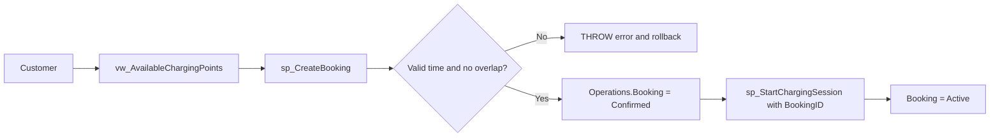
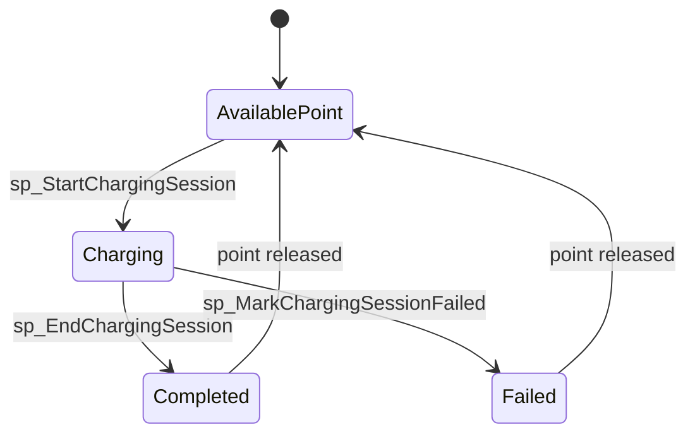
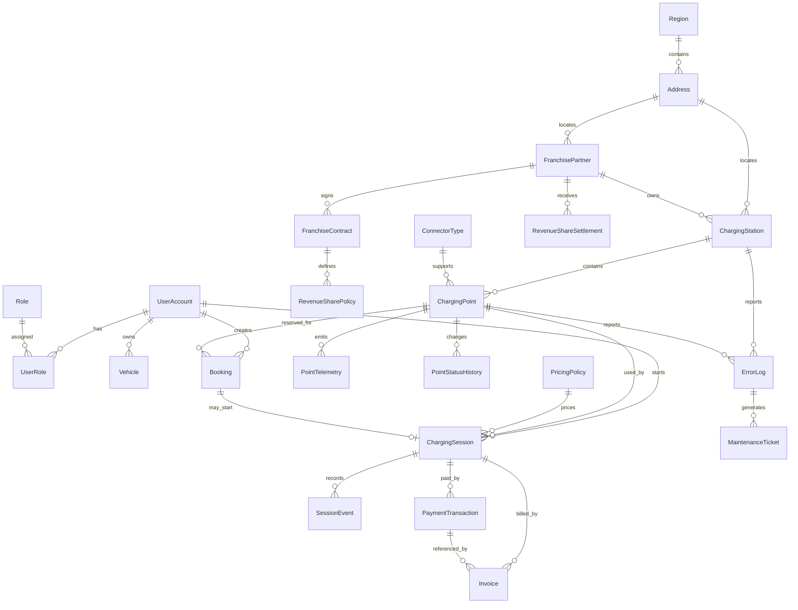

# 1. System Overview

Tai lieu nay phan tich source code database cua do an `EV_Charging_System` theo huong mon hoc He Quan Tri Co So Du Lieu. Trong source hien tai, backend va frontend khong con duoc giu lai; pham vi ky thuat tap trung vao SQL Server database, stored procedure, view, trigger, RBAC, seed data va cac script demo trong thu muc `database`.

### Project Name

`EV_Charging_System` la he thong quan ly mang tram sac xe dien, cong sac, khach hang, phien sac, thanh toan, doi tac franchise, bao tri va bao cao doanh thu.

### Business Problem

He thong mo phong bai toan quan ly thong tin cho mang tram sac xe dien:

- Khach hang can tim cong sac kha dung, dat lich, bat dau va ket thuc phien sac.
- Don vi van hanh can theo doi trang thai tram/cong sac, xu ly loi va ticket bao tri.
- Quan ly kinh doanh can theo doi doanh thu, KPI, tang truong khach hang va chia doanh thu cho franchise partner.
- Quan tri he thong can quan ly tai khoan, vai tro, audit va quyen truy cap.

### Project Goals

| Goal | Database implementation |
|---|---|
| Quan ly thong tin tram sac | `Infrastructure.ChargingStation`, `Infrastructure.ChargingPoint`, `Infrastructure.ConnectorType` |
| Quan ly khach hang va xe | `[Identity].UserAccount`, `[Identity].Role`, `[Identity].UserRole`, `Operations.Vehicle` |
| Quan ly booking va phien sac | `Operations.Booking`, `Operations.ChargingSession`, `Operations.SessionEvent` |
| Tinh gia va thanh toan | `Operations.PricingPolicy`, `Payments.PaymentTransaction`, `Payments.Invoice` |
| Quan ly franchise | `Franchise.FranchisePartner`, `Franchise.FranchiseContract`, `Franchise.RevenueSharePolicy`, `Franchise.RevenueShareSettlement` |
| Bao tri va telemetry | `Maintenance.ErrorLog`, `Maintenance.MaintenanceTicket`, `Infrastructure.PointTelemetry` |
| Bao cao/KPI | 20 view va 6 reporting procedures trong schema `AppView` |
| Bao mat | SQL Server database roles, users, `GRANT`, `DENY`, Dynamic Data Masking demo, RLS demo tam thoi |

### Actors

| Actor | Database role | Main actions |
|---|---|---|
| System Admin | `db_ev_system_admin` | Quan ly user, role, audit, schema data, backup/restore demo |
| Operations Staff | `db_ev_operations_staff` | Quan ly tram/cong sac, session loi, maintenance ticket, telemetry |
| Business Manager | `db_ev_business_manager` | Xem report, pricing policy, revenue sharing, settlement |
| Customer | `db_ev_customer` | Xem cong kha dung, quan ly xe, booking, charging session, payment, invoice |
| Franchise Partner | `db_ev_franchise_partner` | Xem ho so, hop dong, tram, revenue share policy va settlement cua chinh franchise minh |

### Main Modules

- `Core`: region va address.
- `Identity`: user, role, user-role mapping.
- `Infrastructure`: supplier, station, connector, point, telemetry, status history.
- `Operations`: vehicle, pricing policy, booking, charging session, session event.
- `Payments`: payment transaction va invoice.
- `Franchise`: partner, contract, station assignment, revenue share policy, settlement.
- `Maintenance`: error log va maintenance ticket.
- `AppView`: reporting views va query procedures.
- `Audit`: audit log va trigger chan xoa audit.

### System Scope

Source hien tai la mot database-centric system. Khong co API route, UI route, authentication service hay frontend dashboard trong repository. Cac luong nghiep vu duoc the hien bang stored procedure va demo scripts trong `database/features`.

# 2. Business Workflow

### Booking Flow

1. Customer xem cong sac kha dung qua `AppView.vw_AvailableChargingPoints`.
2. Customer chon vehicle va charging point.
3. Customer goi `Operations.sp_CreateBooking`.
4. Procedure kiem tra user active, vehicle thuoc user, thoi gian hop le, point bookable va khong bi overlap.
5. Booking duoc tao voi `BookingStatus = 'Confirmed'`.
6. Khi bat dau session co `@BookingID`, `Operations.sp_StartChargingSession` cap nhat booking sang `Active`.


```mermaid
flowchart LR
    A["Customer"] --> B["vw_AvailableChargingPoints"]
    B --> C["sp_CreateBooking"]
    C --> D{"Valid time and no overlap?"}
    D -- "No" --> E["THROW error and rollback"]
    D -- "Yes" --> F["Operations.Booking = Confirmed"]
    F --> G["sp_StartChargingSession with BookingID"]
    G --> H["Booking = Active"]
```

### Charging/Session Flow

1. Customer hoac demo script chon `PointID` dang `Available`.
2. `Operations.sp_StartChargingSession` tao `Operations.ChargingSession` voi `SessionStatus = 'Charging'`.
3. Procedure doi `Infrastructure.ChargingPoint.PointStatus` sang `Charging`.
4. `Operations.SessionEvent` ghi event `Started`.
5. `Operations.sp_EndChargingSession` tinh `TotalKWh`, duration, `CostBeforeTax`, tax 8% va `CostTotal`.
6. Procedure doi session sang `Completed`, point ve `Available`, ghi event `Completed`.
7. Neu co loi, `Operations.sp_MarkChargingSessionFailed` doi session sang `Failed` va giai phong point.


```mermaid
stateDiagram-v2
    [*] --> AvailablePoint
    AvailablePoint --> Charging: sp_StartChargingSession
    Charging --> Completed: sp_EndChargingSession
    Charging --> Failed: sp_MarkChargingSessionFailed
    Completed --> AvailablePoint: point released
    Failed --> AvailablePoint: point released
```

### Payment Flow

1. Session phai o trang thai `Completed`.
2. Customer goi `Payments.sp_CreatePayment`.
3. Procedure lay `CostTotal` tu session, kiem tra session thuoc user va chua co payment `Completed`.
4. Tao `Payments.PaymentTransaction` voi status `Completed`.
5. Customer goi `Payments.sp_CreateInvoice`.
6. Invoice duoc tao voi `InvoiceStatus = 'Paid'` neu da co transaction completed, nguoc lai la `Issued`.
7. Business manager co demo hoan tien qua `Payments.sp_RefundPayment`, cap nhat payment va invoice sang `Refunded`.

### Franchise Flow

1. `Franchise.FranchisePartner` dai dien doi tac.
2. `Franchise.FranchiseContract` luu hop dong, ngay hieu luc va `BaseRevenueShareRate`.
3. `Franchise.RevenueSharePolicy` luu ty le chia doanh thu hien hanh.
4. `Infrastructure.ChargingStation.FranchiseID` gan station voi partner.
5. `Franchise.sp_CreateRevenueSettlement` tong hop gross revenue tu completed sessions theo franchise va period.
6. `Franchise.fn_CalculatePartnerShare` tinh partner share; platform share la phan con lai.
7. `Franchise.RevenueShareSettlement` luu settlement voi status `Approved`.
8. Franchise Partner dang nhap bang `franchise01..franchise08` va xem ket qua cua minh qua cac AppView `vw_My*` duoc loc theo `ContactUserID`.

### Reporting Flow

1. Du lieu giao dich nam trong cac schema nghiep vu.
2. `AppView` tao cac view tong hop: revenue, customer growth, top station, KPI, maintenance, payment.
3. Reporting procedures doc view va tra dataset demo.
4. Business manager chi duoc cap quyen doc cac view/report can thiet, khong doc truc tiep bang nhay cam trong `Payments` va `Identity`.

# 3. Database Architecture

### DBMS Used

- DBMS: Microsoft SQL Server.
- Database: `EV_Charging_System`.
- Recovery model: `SIMPLE` trong `00_Drop_And_Create_Database.sql`.
- Database objects: 9 schemas, 27 tables, 40 indexes, 3 scalar functions, 34 stored procedures, 4 triggers, 20 views.

### Folder Structure

| Path | Purpose |
|---|---|
| `database/00_Drop_And_Create_Database.sql` | Drop/create database va set recovery model |
| `database/01_Create_Schemas.sql` | Tao schema/domain namespace |
| `database/02_Create_Tables.sql` | Tao bang, PK, FK, CHECK, UNIQUE |
| `database/03_Create_Constraints_Indexes.sql` | Tao nonclustered indexes |
| `database/04_Create_Functions.sql` | Business calculation functions |
| `database/05_Create_Stored_Procedures.sql` | Transactional/business procedures |
| `database/06_Create_Triggers.sql` | Audit/status triggers |
| `database/07_Create_AppViews.sql` | Reporting views va reporting procedures |
| `database/08_Create_Security.sql` | Core RBAC, users, roles, GRANT, DENY |
| `database/09_Advanced_Security.sql` | Dynamic Data Masking cho identity data |
| `database/09_Seed_Demo_Data.sql` | Seed data lon cho demo 2 nam |
| `database/12_Backup_Restore.sql` | Script mau backup/restore |
| `database/features` | Scenario scripts theo role, security va negative tests |

### Schema Separation

| Schema | Responsibility | Main tables/views | Security boundary |
|---|---|---|---|
| `Core` | Reference location data | `Region`, `Address` | Admin full DML; other roles access indirectly |
| `[Identity]` | Account and logical business roles | `UserAccount`, `Role`, `UserRole` | Denied to customer, operations staff, business manager |
| `Infrastructure` | Physical charging network | `ChargingStation`, `ChargingPoint`, `ConnectorType`, telemetry | Operations staff can operate; business manager cannot mutate |
| `Operations` | Vehicle, booking, charging session, pricing | `Vehicle`, `Booking`, `ChargingSession`, `PricingPolicy` | Customer uses procedures; operations staff can operate |
| `Payments` | Payment transaction and invoice | `PaymentTransaction`, `Invoice` | Direct table access denied to customer, operations staff, business manager |
| `Franchise` | Partner contracts and settlement | `FranchisePartner`, `RevenueShareSettlement` | Business manager can execute settlement procedures |
| `Maintenance` | Device error and ticket handling | `ErrorLog`, `MaintenanceTicket` | Operations staff can operate; business manager read/report only |
| `AppView` | Read model and reporting API | 20 views, 6 reporting procedures | Main read surface for demo roles |
| `Audit` | Audit trail | `AuditLog` | Admin accessible; delete blocked by trigger |

### Architectural Style

The project uses a database-centric, domain-driven schema organization:

- Transaction logic is implemented in stored procedures with `BEGIN TRANSACTION`, `COMMIT`, `ROLLBACK`, `TRY/CATCH`, `THROW`, and `XACT_ABORT ON`.
- Read-side/reporting logic is separated into `AppView` views and report procedures.
- Security uses SQL Server database roles and schema/object-level permissions.
- Audit is centralized in `Audit.AuditLog` and reinforced by triggers.

# 4. Data Modeling

### Conceptual Model

At conceptual level, the system contains these business concepts:

- User owns vehicles.
- User creates bookings and charging sessions.
- Charging station contains charging points.
- Charging point has connector type, status, health and telemetry.
- Charging session consumes energy and generates cost.
- Completed charging session can produce payment and invoice.
- Station belongs to franchise partner and contract.
- Revenue sharing settlement is calculated from completed sessions.
- Maintenance ticket is created from station/point error.
- Audit log records important state changes.

### Logical Model

| Relationship | Cardinality | Implementation |
|---|---:|---|
| Region to Address | 1:N | `Core.Address.RegionID` FK |
| UserAccount to Role | M:N | `[Identity].UserRole` junction table |
| FranchisePartner to ChargingStation | 1:N | `Infrastructure.ChargingStation.FranchiseID` FK |
| FranchisePartner to ChargingStation through contract | M:N context | `Franchise.FranchiseStation` junction table |
| ChargingStation to ConnectorType | M:N | `Infrastructure.StationConnectorType` junction table |
| ChargingStation to ChargingPoint | 1:N | `Infrastructure.ChargingPoint.StationID` FK |
| UserAccount to Vehicle | 1:N | `Operations.Vehicle.UserID` FK |
| UserAccount to Booking | 1:N | `Operations.Booking.UserID` FK |
| ChargingPoint to Booking | 1:N over time | `Operations.Booking.PointID` FK plus overlap validation |
| ChargingPoint to ChargingSession | 1:N over time | `Operations.ChargingSession.PointID` FK |
| ChargingSession to PaymentTransaction | 1:N physical, 1 completed payment enforced in procedure | `Payments.PaymentTransaction.SessionID` FK |
| ChargingSession to Invoice | 1:N physical, one invoice enforced in procedure | `Payments.Invoice.SessionID` FK |
| ErrorLog to MaintenanceTicket | 1:N possible, source creates one auto ticket | `Maintenance.MaintenanceTicket.ErrorID` FK |

### Physical Model

Physical design characteristics:

- Surrogate keys: most entity tables use `INT IDENTITY`; high-volume transactional tables use `BIGINT IDENTITY`.
- Natural/business codes: `RegionCode`, `StationCode`, `PointCode`, `BookingCode`, `SessionCode`, `TransactionCode`, `InvoiceCode`, `SettlementCode` use `UNIQUE`.
- Integrity constraints: PK/FK, CHECK, UNIQUE and computed columns.
- Indexes: 40 indexes support FK lookup, status filtering, user timeline, point-time lookup, station-time revenue and audit lookup.
- Computed columns: `Core.Address.FullAddress`, `Franchise.RevenueSharePolicy.PlatformShareRate`.

### ERD Summary


```mermaid
erDiagram
    Region ||--o{ Address : contains
    Address ||--o{ ChargingStation : locates
    Address ||--o{ FranchisePartner : locates

    UserAccount ||--o{ UserRole : has
    Role ||--o{ UserRole : assigned
    UserAccount ||--o{ Vehicle : owns
    UserAccount ||--o{ Booking : creates
    UserAccount ||--o{ ChargingSession : starts

    FranchisePartner ||--o{ FranchiseContract : signs
    FranchisePartner ||--o{ ChargingStation : owns
    FranchiseContract ||--o{ RevenueSharePolicy : defines
    FranchisePartner ||--o{ RevenueShareSettlement : receives

    ChargingStation ||--o{ ChargingPoint : contains
    ConnectorType ||--o{ ChargingPoint : supports
    ChargingPoint ||--o{ PointTelemetry : emits
    ChargingPoint ||--o{ PointStatusHistory : changes
    ChargingPoint ||--o{ Booking : reserved_for
    ChargingPoint ||--o{ ChargingSession : used_by

    PricingPolicy ||--o{ ChargingSession : prices
    Booking ||--o| ChargingSession : may_start
    ChargingSession ||--o{ SessionEvent : records
    ChargingSession ||--o{ PaymentTransaction : paid_by
    ChargingSession ||--o{ Invoice : billed_by
    PaymentTransaction ||--o{ Invoice : referenced_by

    ChargingStation ||--o{ ErrorLog : reports
    ChargingPoint ||--o{ ErrorLog : reports
    ErrorLog ||--o{ MaintenanceTicket : generates
```

### Normalization

- 1NF: tables use atomic columns for identity, status, amount, time and FK values.
- 2NF: junction tables use composite PKs where attributes depend on the full key, e.g. `UserRole`, `FranchiseStation`, `StationConnectorType`.
- 3NF: reference/domain data is separated into schemas and tables, e.g. connector type, region, pricing policy and franchise contract are not duplicated inside session rows except through FK references.
- Controlled denormalization: `ChargingSession` stores calculated `TotalKWh`, `DurationMinutes`, `CostBeforeTax`, `TaxAmount`, `CostTotal` to preserve billing history at transaction time.

# 5. Core Entities Analysis

### Entity Summary

| Schema | Tables |
|---|---|
| `Core` | `Region`, `Address` |
| `[Identity]` | `Role`, `UserAccount`, `UserRole` |
| `Franchise` | `FranchisePartner`, `FranchiseContract`, `FranchiseStation`, `RevenueSharePolicy`, `RevenueShareSettlement` |
| `Infrastructure` | `ElectricitySupplier`, `ChargingStation`, `ConnectorType`, `StationConnectorType`, `ChargingPoint`, `PointStatusHistory`, `PointTelemetry` |
| `Operations` | `Vehicle`, `PricingPolicy`, `Booking`, `ChargingSession`, `SessionEvent` |
| `Payments` | `PaymentTransaction`, `Invoice` |
| `Maintenance` | `ErrorLog`, `MaintenanceTicket` |
| `Audit` | `AuditLog` |

## Core.Region

### Purpose

Reference table for provinces/cities or operating regions.

### Main Columns

| Column | Meaning |
|---|---|
| `RegionID` | Surrogate PK |
| `RegionCode` | Unique business code |
| `RegionName` | Region name |
| `TimeZone` | Defaults to `Asia/Ho_Chi_Minh` |
| `IsActive` | Soft activation flag |

### Relationships

- Parent of `Core.Address`.
- Parent of `Infrastructure.ElectricitySupplier`.

### Business Rules

- `RegionCode` must be unique.

### Indexing Strategy

- Natural uniqueness through `UQ_Region_Code`.

## Core.Address

### Purpose

Stores physical address and coordinates for franchise offices and charging stations.

### Main Columns

`AddressID`, `RegionID`, `StreetAddress`, `Ward`, `District`, `Latitude`, `Longitude`, computed `FullAddress`.

### Relationships

- FK to `Core.Region`.
- Referenced by `Franchise.FranchisePartner` and `Infrastructure.ChargingStation`.

### Business Rules

- Latitude must be between -90 and 90.
- Longitude must be between -180 and 180.

### Indexing Strategy

- `IX_Address_RegionID` supports region-based station/report lookup.

## [Identity].UserAccount

### Purpose

Stores application-level account identity. Authentication implementation is not present as backend code; password hash is stored for database demo purposes.

### Main Columns

`UserID`, `Username`, `Email`, `Phone`, `PasswordHash`, `FullName`, `AccountStatus`, timestamps.

### Relationships

- M:N with `[Identity].Role` through `[Identity].UserRole`.
- Parent of vehicles, bookings, sessions, payments, invoices and maintenance actions.

### Business Rules

- Username, email and phone are unique.
- `AccountStatus` allowed values: `Pending`, `Active`, `Suspended`, `Locked`.
- Procedures check active users before business operations.

### Indexing Strategy

- `IX_UserAccount_Status` supports status filtering for admin/security operations.

## [Identity].Role and [Identity].UserRole

### Purpose

Logical application role model seeded with `SystemAdmin`, `OperationsStaff`, `BusinessManager`, and `Customer`.

### Main Columns

- `Role`: `RoleID`, `RoleCode`, `RoleName`, `Description`, `IsSystemRole`.
- `UserRole`: composite PK `(UserID, RoleID)`, `AssignedAt`.

### Relationships

- `UserRole` is a junction table between user and role.

### Business Rules

- `RoleCode` is unique.
- A user-role assignment cannot duplicate because of composite PK.

### Indexing Strategy

- `IX_UserRole_RoleID` supports role membership lookup.

## Infrastructure.ChargingStation

### Purpose

Represents a physical charging station in the EV charging network.

### Main Columns

`StationID`, `StationCode`, `StationName`, `FranchiseID`, `AddressID`, `SupplierID`, `StationOperatorID`, `MaxPowerKW`, `StationStatus`.

### Relationships

- Belongs to `Franchise.FranchisePartner`.
- Located at `Core.Address`.
- May use `Infrastructure.ElectricitySupplier`.
- May be assigned to a station operator in `[Identity].UserAccount`.
- Parent of `Infrastructure.ChargingPoint`, `Operations.Booking`, `Operations.ChargingSession`, `Maintenance.ErrorLog`, `Maintenance.MaintenanceTicket`.

### Business Rules

- `StationCode` is unique.
- `MaxPowerKW > 0`.
- `StationStatus` allowed values: `Active`, `Inactive`, `UnderMaintenance`, `Retired`.

### Indexing Strategy

- `IX_ChargingStation_FranchiseID` for franchise settlement/reporting.
- `IX_ChargingStation_Status` for operational overview.
- `IX_ChargingStation_AddressID` for location lookup.

## Infrastructure.ChargingPoint

### Purpose

Represents an individual charging point/charger connector that can be booked and used in charging sessions.

### Main Columns

`PointID`, `PointCode`, `StationID`, `ConnectorTypeID`, `PowerKW`, `SerialNumber`, `PointStatus`, `HealthStatus`.

### Relationships

- Belongs to `Infrastructure.ChargingStation`.
- Uses `Infrastructure.ConnectorType`.
- Parent of booking, charging session, telemetry and status history.

### Business Rules

- `PointCode` and `SerialNumber` are unique.
- `PowerKW > 0`.
- `PointStatus` allowed values: `Available`, `Reserved`, `Charging`, `Offline`, `Error`, `Maintenance`, `Retired`.
- `HealthStatus` allowed values: `Normal`, `Warning`, `Critical`, `Offline`.
- `Operations.sp_StartChargingSession` only accepts point status `Available`.
- `Operations.sp_CreateBooking` accepts point status `Available` or `Reserved`, then checks booking overlap.

### Indexing Strategy

- `IX_ChargingPoint_StationID` for station-to-point lookup.
- `IX_ChargingPoint_ConnectorStatus` for available connector search.

## Infrastructure.PointTelemetry

### Purpose

Stores sampled device telemetry for health monitoring.

### Main Columns

`TelemetryID`, `PointID`, `Voltage`, `CurrentAmp`, `TemperatureC`, `PowerKW`, `HealthStatus`, `RecordedAt`.

### Relationships

- Child of `Infrastructure.ChargingPoint`.

### Business Rules

- Voltage, current and power are non-negative when present.
- Health status is constrained to the same controlled domain as charging point health.

### Indexing Strategy

- `IX_PointTelemetry_PointTime` supports latest telemetry per point.
- `IX_PointTelemetry_Health` supports issue filtering.

## Operations.Vehicle

### Purpose

Stores EV profiles owned by customers.

### Main Columns

`VehicleID`, `UserID`, `PlateNumber`, `Brand`, `Model`, `BatteryCapacityKWh`, `PreferredConnectorTypeID`, `IsActive`.

### Relationships

- Belongs to `[Identity].UserAccount`.
- Optional preferred connector references `Infrastructure.ConnectorType`.
- Referenced by booking and charging session.

### Business Rules

- Plate number is unique.
- Battery capacity must be positive when present.
- `Operations.sp_CreateVehicle` requires active user.
- `Operations.sp_UpdateVehicle` requires vehicle ownership by user.
- Soft delete is implemented by `IsActive`, demonstrated in `features/security/07_soft_delete_demo.sql`.

### Indexing Strategy

- `IX_Vehicle_UserID` supports customer vehicle lookup.

## Operations.Booking

### Purpose

Stores advance reservations for charging points.

### Main Columns

`BookingID`, `BookingCode`, `UserID`, `VehicleID`, `StationID`, `PointID`, `BookedFrom`, `BookedTo`, `BookingStatus`.

### Relationships

- Belongs to user, optional vehicle, station and point.
- Optional parent of `Operations.ChargingSession`.

### Business Rules

- `BookedFrom < BookedTo`.
- `BookingStatus` allowed values: `Pending`, `Confirmed`, `Active`, `Completed`, `Cancelled`, `Expired`.
- `Operations.sp_CreateBooking` rejects overlapping active bookings for the same point.
- `Operations.sp_CancelBooking` only cancels pending/confirmed/active bookings.

### Indexing Strategy

- `IX_Booking_UserTime` for customer booking history.
- `IX_Booking_PointTime` for overlap detection.
- `IX_Booking_Status` for operational filtering.

## Operations.ChargingSession

### Purpose

Central transaction table for actual charging activity, energy consumption and billing amount.

### Main Columns

`SessionID`, `SessionCode`, `UserID`, `VehicleID`, `StationID`, `PointID`, `PolicyID`, `BookingID`, `StartTime`, `EndTime`, `MeterStart`, `MeterEnd`, `TotalKWh`, `DurationMinutes`, `CostBeforeTax`, `TaxAmount`, `CostTotal`, `SessionStatus`, `StopReason`.

### Relationships

- Belongs to user, optional vehicle, station, point, pricing policy and optional booking.
- Parent of session event, payment transaction and invoice.

### Business Rules

- Status domain: `Pending`, `Charging`, `Completed`, `Cancelled`, `Failed`, `EmergencyStopped`.
- `EndTime` must be null or greater/equal `StartTime`.
- `TotalKWh` and `CostTotal` must be non-negative when present.
- Start procedure requires point available and active user.
- End procedure requires current status `Charging` and positive kWh.
- Failed procedure only accepts `Pending` or `Charging`.

### Indexing Strategy

- `IX_ChargingSession_UserTime` supports customer history.
- `IX_ChargingSession_StationTime` supports station revenue reporting.
- `IX_ChargingSession_PointStatus` supports point/session state lookup.
- `IX_ChargingSession_StatusTime` supports active/completed/failed filters.

## Operations.PricingPolicy

### Purpose

Defines pricing per kWh and optional peak-hour multiplier.

### Main Columns

`PolicyID`, `PolicyCode`, `PolicyName`, `BasePricePerKWh`, `PeakMultiplier`, `PeakStartHour`, `PeakEndHour`, `AppliedFrom`, `AppliedTo`, `IsActive`.

### Relationships

- Referenced by `Operations.ChargingSession`.
- Used by `Operations.fn_CalculateChargingCost`.

### Business Rules

- Base price must be non-negative.
- Peak multiplier must be at least 1.
- Applied time range must be valid.

## Payments.PaymentTransaction

### Purpose

Stores payment records for completed charging sessions.

### Main Columns

`TransactionID`, `TransactionCode`, `UserID`, `SessionID`, `PaymentMethod`, `Amount`, `TransactionStatus`, `ProviderReference`, `PaidAt`.

### Relationships

- Belongs to user and charging session.
- Referenced by invoice.

### Business Rules

- Amount must be non-negative.
- Payment method: `CASH`, `QR`, `BANK_TRANSFER`.
- Status: `Pending`, `Completed`, `Failed`, `Cancelled`, `Refunded`.
- `Payments.sp_CreatePayment` rejects duplicate completed payment for a session.
- `Payments.sp_RefundPayment` only refunds completed payment.

### Indexing Strategy

- `IX_PaymentTransaction_UserTime`.
- `IX_PaymentTransaction_SessionID`.
- `IX_PaymentTransaction_StatusMethod`.

## Payments.Invoice

### Purpose

Stores invoice data derived from charging session and payment state.

### Main Columns

`InvoiceID`, `InvoiceCode`, `UserID`, `SessionID`, `TransactionID`, `Subtotal`, `TaxAmount`, `TotalAmount`, `InvoiceStatus`, `IssuedAt`.

### Relationships

- Belongs to user and charging session.
- Optionally references payment transaction.

### Business Rules

- Amount fields must be non-negative.
- Status: `Issued`, `Paid`, `Cancelled`, `Refunded`.
- `Payments.sp_CreateInvoice` blocks duplicate invoice by session.

### Indexing Strategy

- `IX_Invoice_UserTime`.
- `IX_Invoice_SessionID`.

## Franchise.FranchisePartner

### Purpose

Stores business partners/franchisees associated with charging stations.

### Main Columns

`FranchiseID`, `FranchiseCode`, `FranchiseName`, `TaxCode`, `AddressID`, `ContactUserID`, contact fields, `PartnerStatus`.

### Relationships

- Optional address and contact user.
- Parent of contracts, stations and settlements.

### Business Rules

- Franchise code and tax code are unique.
- Partner status: `Pending`, `Active`, `Suspended`, `Terminated`.

## Franchise.FranchiseContract

### Purpose

Stores active business contract between platform and franchise partner.

### Main Columns

`ContractID`, `FranchiseID`, `ContractCode`, `StartDate`, `EndDate`, `BaseRevenueShareRate`, `ContractStatus`.

### Relationships

- Belongs to franchise partner.
- Parent of `RevenueSharePolicy`, `FranchiseStation`, and `RevenueShareSettlement`.

### Business Rules

- `StartDate < EndDate`.
- Revenue share rate between 0 and 100.
- Status: `Draft`, `Active`, `Expired`, `Terminated`.

## Franchise.RevenueSharePolicy

### Purpose

Defines partner share rate for a contract.

### Main Columns

`RevenueSharePolicyID`, `ContractID`, `PolicyCode`, `PartnerShareRate`, computed `PlatformShareRate`, `AppliedFrom`, `AppliedTo`, `IsActive`.

### Business Rules

- Partner share rate between 0 and 100.
- `PlatformShareRate = 100 - PartnerShareRate`.
- Applied date range must be valid.

## Franchise.RevenueShareSettlement

### Purpose

Stores settlement output for a franchise period.

### Main Columns

`SettlementID`, `SettlementCode`, `FranchiseID`, `ContractID`, `PeriodStart`, `PeriodEnd`, `GrossRevenue`, `PartnerShareAmount`, `PlatformShareAmount`, `SettlementStatus`.

### Business Rules

- `PeriodStart <= PeriodEnd`.
- Amounts must be non-negative.
- Status: `Draft`, `Approved`, `Paid`, `Cancelled`.
- `Franchise.sp_CreateRevenueSettlement` currently creates settlement as `Approved`.

### Indexing Strategy

- `IX_RevenueShareSettlement_Franchise_Period`.
- `IX_RevenueShareSettlement_Status`.

## Maintenance.ErrorLog

### Purpose

Records station/point errors.

### Main Columns

`ErrorID`, `ErrorCode`, `StationID`, `PointID`, `Severity`, `Description`, `OccurredAt`, `ResolvedAt`, `ResolvedBy`, `IsActive`.

### Relationships

- Optional station, point and resolving user.
- Parent of maintenance ticket.

### Business Rules

- Severity: `Low`, `Medium`, `High`, `Critical`.
- `Maintenance.sp_ReportError` can update point status to `Error` and health to `Critical`.

## Maintenance.MaintenanceTicket

### Purpose

Stores work items for device/station maintenance.

### Main Columns

`TicketID`, `TicketCode`, `StationID`, `PointID`, `ErrorID`, `CreatedBy`, `AssignedTo`, `Priority`, `TicketStatus`, `Title`, `OpenedAt`, `ClosedAt`.

### Business Rules

- Priority: `Low`, `Medium`, `High`, `Critical`.
- Status: `Open`, `Assigned`, `InProgress`, `Resolved`, `Closed`, `Cancelled`.
- `Maintenance.sp_CloseTicket` closes ticket, resolves linked error, and returns point to `Available`/`Normal`.

## Audit.AuditLog

### Purpose

Central audit table for significant changes and security/payment/settlement events.

### Main Columns

`AuditID`, `SchemaName`, `TableName`, `RecordID`, `ActionType`, `OldValues`, `NewValues`, `ChangedBy`, `ChangedAt`.

### Business Rules

- Action type: `INSERT`, `UPDATE`, `DELETE`, `PAYMENT`, `SETTLEMENT`, `SECURITY`.
- Delete is blocked by `Audit.trg_AuditLog_BlockDelete`.

### Indexing Strategy

- `IX_AuditLog_TableTime` supports audit lookup by object and time.

# 6. Security Architecture

### Core Security Model

Security is implemented in `database/08_Create_Security.sql`.

```text
Server Login -> Database User -> Database Role -> Schema/Object Permission
```

The core demo creates database users `WITHOUT LOGIN` so that permissions can be tested using `EXECUTE AS USER` inside SSMS:

- `admin01`
- `operator01`
- `business01`
- `customer01`

An optional SQL Authentication script, `database/features/security/08_sql_authentication_logins.sql`, maps those users to real SQL Server logins:

- `ev_admin01_login`
- `ev_operator01_login`
- `ev_business01_login`
- `ev_customer01_login`

### Database Roles

| Database role | Intended actor | Permission summary |
|---|---|---|
| `db_ev_system_admin` | System admin | Full DML on all schemas and `EXECUTE`; `UNMASK` if advanced security is run |
| `db_ev_operations_staff` | Operator | DML on `Infrastructure`, `Operations`, `Maintenance`; read `AppView`; execute operational procedures |
| `db_ev_business_manager` | Manager | Read selected reporting views; execute settlement/reporting procedures; no direct payment/identity table access |
| `db_ev_customer` | Customer | Read customer-facing views; execute vehicle, booking, session, payment and invoice procedures |
| `db_ev_franchise_partner` | Franchise partner | Read only own franchise profile, contracts, stations, policies and settlements through `AppView` objects |

### Least Privilege Design

- Customer does not receive direct table access to `[Identity]` or `Payments`; only views and procedures are exposed.
- Operations staff cannot read identity/payment schemas directly, reducing exposure to sensitive account and financial data.
- Business manager reads reporting views instead of mutating operational tables.
- Franchise partner reads only self-service AppView objects filtered through `FranchisePartner.ContactUserID`; it cannot read base franchise, identity, payment or operations tables directly.
- System admin is broad but still modeled as a database role rather than relying only on `sysadmin`/`db_owner` in the demo.

### Schema-Level Permissions

Examples from source:

```sql
GRANT SELECT, INSERT, UPDATE ON SCHEMA::Infrastructure TO db_ev_operations_staff;
GRANT SELECT ON OBJECT::AppView.vw_StationRevenueDaily TO db_ev_business_manager;
GRANT EXECUTE ON OBJECT::Operations.sp_CreateBooking TO db_ev_customer;
DENY SELECT, INSERT, UPDATE, DELETE ON SCHEMA::Payments TO db_ev_customer;
DENY SELECT, INSERT, UPDATE, DELETE ON SCHEMA::[Identity] TO db_ev_customer;
```

### Why Managers Read Through Views

Business managers need aggregated business facts, not raw sensitive rows. `AppView` views expose:

- station revenue,
- franchise monthly revenue,
- profit sharing,
- payment summary,
- peak hours,
- customer growth,
- system KPI.

This reduces coupling between reporting users and base transaction tables.

### Why Customers Do Not Read Tables Directly

Customer procedures and views avoid direct DML on critical transaction tables. This is important because:

- `Payments` contains amounts, transaction status and provider references.
- `[Identity]` contains email, phone and password hash.
- `Operations` base tables contain sessions of all users.

Limitation: the customer-facing views in `AppView` are not permanently filtered by current database user. The source contains a temporary Row-Level Security demo in `features/security/06_row_level_security_demo.sql`, but RLS is not installed as part of the core schema.

### Why Stored Procedures Are Used

Stored procedures act as controlled transaction boundaries:

- Validate inputs with `THROW`.
- Use `BEGIN TRANSACTION`, `COMMIT`, `ROLLBACK`.
- Keep state transitions consistent across multiple tables.
- Preserve audit trail.
- Allow `EXECUTE` permissions without exposing direct table write permissions.

### EXECUTE AS

The core stored procedures do not define `WITH EXECUTE AS`. The source uses `EXECUTE AS USER` in feature scripts to test RBAC behavior. This is a valid demo pattern for database permission testing, but a production hardening improvement would be to review module signing or explicit `EXECUTE AS OWNER` for selected procedure surfaces.

### Advanced Security

`database/09_Advanced_Security.sql` enables Dynamic Data Masking:

- `[Identity].UserAccount.Email` with `email()`.
- `[Identity].UserAccount.Phone` with `partial(0,"XXXX",4)`.
- `[Identity].UserAccount.PasswordHash` with `default()`.
- `GRANT UNMASK TO db_ev_system_admin`.

Additional feature scripts:

- `security/05_masking_demo.sql`: masking behavior.
- `security/06_row_level_security_demo.sql`: temporary RLS policy on `Operations.ChargingSession`.
- `security/07_soft_delete_demo.sql`: soft delete by `Operations.Vehicle.IsActive`.
- `security/08_sql_authentication_logins.sql`: real SQL logins for SSMS demo.

# 7. Stored Procedures, Functions & Triggers

### Functions

| Object | Purpose | Tables affected/read |
|---|---|---|
| `Operations.fn_CalculateChargingCost` | Calculates charging cost from kWh, pricing policy and start time; applies peak multiplier | Reads `Operations.PricingPolicy` |
| `Franchise.fn_CalculatePartnerShare` | Calculates partner share from gross revenue and share rate | No table access |
| `AppView.fn_PointUtilizationRate` | Calculates completed-session utilization percentage for a point in a date range | Reads `Operations.ChargingSession` |

### Identity Procedures

| Procedure | Purpose | Main tables affected |
|---|---|---|
| `[Identity].sp_CreateUser` | Create user and initial role | `UserAccount`, `UserRole`, `AuditLog` |
| `[Identity].sp_LockUser` | Set account status to `Locked` | `UserAccount`, `AuditLog` |
| `[Identity].sp_UnlockUser` | Set account status to `Active` | `UserAccount`, `AuditLog` |
| `[Identity].sp_ResetPassword` | Update password hash | `UserAccount`, `AuditLog` |
| `[Identity].sp_AssignRole` | Add role membership | `UserRole`, `AuditLog` |
| `[Identity].sp_RemoveRole` | Remove role membership | `UserRole`, `AuditLog` |

### Infrastructure Procedures

| Procedure | Purpose | Main tables affected |
|---|---|---|
| `Infrastructure.sp_CreateChargingStation` | Create station | `ChargingStation`, `AuditLog` |
| `Infrastructure.sp_CreateChargingPoint` | Create point and ensure station-connector mapping | `ChargingPoint`, `StationConnectorType`, `AuditLog` |
| `Infrastructure.sp_UpdateStationStatus` | Change station status | `ChargingStation`, `AuditLog` |
| `Infrastructure.sp_UpdateChargingPointStatus` | Change point status/health | `ChargingPoint`, `AuditLog`, trigger creates status history |

### Operations Procedures

| Procedure | Purpose | Main tables affected |
|---|---|---|
| `Operations.sp_CreateVehicle` | Add vehicle for active user | `Vehicle`, `AuditLog` |
| `Operations.sp_UpdateVehicle` | Update vehicle owned by user | `Vehicle`, `AuditLog` |
| `Operations.sp_CreateBooking` | Create non-overlapping booking | `Booking`, `AuditLog` |
| `Operations.sp_CancelBooking` | Cancel active booking | `Booking`, `AuditLog` |
| `Operations.sp_StartChargingSession` | Start session, mark point charging, optionally activate booking | `ChargingSession`, `ChargingPoint`, `Booking`, `SessionEvent` |
| `Operations.sp_EndChargingSession` | Complete session and calculate cost/tax | `ChargingSession`, `ChargingPoint`, `SessionEvent` |
| `Operations.sp_MarkChargingSessionFailed` | Mark failed and release point | `ChargingSession`, `ChargingPoint`, `SessionEvent`, `AuditLog` |
| `Operations.sp_CreatePricingPolicy` | Create pricing policy | `PricingPolicy`, `AuditLog` |
| `Operations.sp_DeactivatePricingPolicy` | Deactivate pricing policy | `PricingPolicy`, `AuditLog` |

### Payment Procedures

| Procedure | Purpose | Main tables affected |
|---|---|---|
| `Payments.sp_CreatePayment` | Create completed payment for completed unpaid session | `PaymentTransaction`, `AuditLog` |
| `Payments.sp_RefundPayment` | Refund completed payment and invoice | `PaymentTransaction`, `Invoice`, `AuditLog` |
| `Payments.sp_CreateInvoice` | Create invoice from completed session and optional payment | `Invoice` |

### Maintenance Procedures

| Procedure | Purpose | Main tables affected |
|---|---|---|
| `Maintenance.sp_ReportError` | Create error log and auto ticket; mark point error | `ErrorLog`, `MaintenanceTicket`, `ChargingPoint` |
| `Maintenance.sp_AssignTicket` | Assign ticket to active user | `MaintenanceTicket`, `AuditLog` |
| `Maintenance.sp_ScheduleMaintenance` | Create maintenance ticket and mark point maintenance | `MaintenanceTicket`, `ChargingPoint`, `AuditLog` |
| `Maintenance.sp_CloseTicket` | Close ticket, resolve error and restore point | `MaintenanceTicket`, `ErrorLog`, `ChargingPoint` |

### Franchise Procedures

| Procedure | Purpose | Main tables affected |
|---|---|---|
| `Franchise.sp_UpdateRevenueSharePolicy` | Update partner share rate and end date | `RevenueSharePolicy`, `AuditLog` |
| `Franchise.sp_CreateRevenueSettlement` | Aggregate gross revenue and create approved settlement | `RevenueShareSettlement`, `AuditLog`; reads `ChargingSession`, `ChargingStation`, `FranchiseContract`, `RevenueSharePolicy` |

### Reporting Procedures in AppView

| Procedure | Purpose |
|---|---|
| `AppView.sp_GetStationRevenue` | Station revenue for date range |
| `AppView.sp_GetFranchiseProfitSharing` | Profit sharing settlement output |
| `AppView.sp_GetOperationalKPI` | Maintenance KPI |
| `AppView.sp_GetPaymentSummary` | Payment method/status summary |
| `AppView.sp_GetCustomerUsage` | Top customer usage |
| `AppView.sp_GetTelemetryHealth` | Points with warning/critical/offline telemetry |

### Triggers

| Trigger | Event | Purpose |
|---|---|---|
| `Infrastructure.trg_ChargingPoint_StatusHistory` | After update on `ChargingPoint` | Inserts point status history and audit rows when point status changes |
| `Operations.trg_ChargingSession_Audit` | After insert/update on `ChargingSession` | Audits session creation and status changes |
| `Payments.trg_PaymentTransaction_Audit` | After insert/update on `PaymentTransaction` | Audits payment creation/status change |
| `Audit.trg_AuditLog_BlockDelete` | Instead of delete on `AuditLog` | Prevents deleting audit logs |

# 8. Business Rules & Constraints

### CHECK Constraints

| Area | Constraint examples |
|---|---|
| Location | Latitude between -90 and 90, longitude between -180 and 180 |
| User | Account status limited to `Pending`, `Active`, `Suspended`, `Locked` |
| Station/point | Station power > 0; point power > 0; station/point/health statuses constrained |
| Vehicle | Battery capacity positive when present |
| Booking | `BookedFrom < BookedTo`; booking status constrained |
| Session | End time not before start; kWh and cost non-negative; status constrained |
| Payment | Amount non-negative; payment method/status constrained |
| Invoice | Subtotal, tax and total non-negative; invoice status constrained |
| Contract/revenue share | Date ranges valid; share rates between 0 and 100 |
| Maintenance | Severity, priority and ticket status constrained |
| Audit | Action type constrained |

### Procedure Validation Rules

| Rule | Procedure |
|---|---|
| Cannot create booking with invalid time | `Operations.sp_CreateBooking` |
| Cannot create overlapping booking on same point | `Operations.sp_CreateBooking` |
| Cannot start session if point not `Available` | `Operations.sp_StartChargingSession` |
| Cannot start session without active pricing policy | `Operations.sp_StartChargingSession` |
| Cannot end session unless status is `Charging` | `Operations.sp_EndChargingSession` |
| Cannot end session with non-positive kWh | `Operations.sp_EndChargingSession` |
| Cannot pay incomplete session | `Payments.sp_CreatePayment` |
| Cannot create duplicate completed payment | `Payments.sp_CreatePayment` |
| Cannot refund non-completed payment | `Payments.sp_RefundPayment` |
| Cannot create duplicate invoice for same session | `Payments.sp_CreateInvoice` |
| Cannot use invalid revenue share rate | `Franchise.sp_UpdateRevenueSharePolicy` |
| Cannot close invalid/closed ticket | `Maintenance.sp_CloseTicket` |

### Transaction and Consistency Rules

Most business procedures use:

```sql
SET XACT_ABORT ON;
BEGIN TRY
    BEGIN TRANSACTION;
    -- validation and DML
    COMMIT TRANSACTION;
END TRY
BEGIN CATCH
    IF @@TRANCOUNT > 0 ROLLBACK TRANSACTION;
    THROW;
END CATCH;
```

This gives atomicity for multi-table changes:

- Start session inserts session, updates point and inserts event in one transaction.
- End session updates billing fields, point status and event in one transaction.
- Report error inserts error, creates ticket and updates point state in one transaction.
- Settlement calculates and inserts revenue share atomically.

### Concurrency and Isolation

The source uses default SQL Server isolation level; no explicit `SERIALIZABLE`, locking hints or application locks are present. Booking overlap is checked inside a transaction, but high-concurrency booking may still need stronger isolation or a locking strategy in production. This is a legitimate limitation and future improvement.

# 9. Reporting & Analytics

### Reporting Architecture

`AppView` is the reporting/read-model schema. It separates analytical queries from base transaction tables and makes RBAC easier because managers can be granted view access without direct base-table access.

### Views

| View | Metric/use |
|---|---|
| `vw_CustomerChargingHistory` | Customer/session history with station, point, connector, kWh, cost |
| `vw_StationRevenueDaily` | Daily station revenue, sessions, kWh, tax |
| `vw_FranchiseRevenueMonthly` | Monthly franchise revenue and station/session count |
| `vw_ProfitSharing` | Settlement and platform/partner share |
| `vw_ConnectorUtilization` | Sessions, kWh and revenue by connector type |
| `vw_MaintenanceKPI` | Ticket/error counts and average resolve hours |
| `vw_PaymentSummary` | Payment count and amount by method/status |
| `vw_AvailableChargingPoints` | Available active station/point list |
| `vw_CustomerBookingHistory` | Booking history |
| `vw_InvoiceDetail` | Invoice/payment/session detail |
| `vw_ActiveChargingSessions` | Currently charging sessions |
| `vw_StationStatusOverview` | Point availability/problem counts by station |
| `vw_PeakHourStatistics` | Sessions, kWh and revenue by start hour |
| `vw_TopRevenueStations` | Station ranking by revenue |
| `vw_CustomerGrowth` | New customers by month |
| `vw_SystemOperationalKPI` | Global station/point/session/ticket/revenue KPI |
| `vw_RegionRevenue` | Revenue by region |
| `vw_UserRoleSummary` | Admin user-role summary |
| `vw_ChargingSessionStatistics` | Session count/kWh/revenue by date and status |
| `vw_MyFranchiseProfile` | Franchise partner profile for current database user |
| `vw_MyFranchiseContracts` | Franchise partner contracts for current database user |
| `vw_MyFranchiseStations` | Franchise partner stations for current database user |
| `vw_MyRevenueSharePolicies` | Franchise partner revenue share policies for current database user |
| `vw_MyRevenueShareSettlements` | Franchise partner settlements/profit sharing for current database user |
| `vw_TopCustomerUsage` | Top customers by completed usage |

### KPI Examples

| KPI | Source |
|---|---|
| Total revenue | `vw_SystemOperationalKPI`, `vw_StationRevenueDaily` |
| Completed sessions | `vw_SystemOperationalKPI`, `vw_ChargingSessionStatistics` |
| Failed sessions | `vw_SystemOperationalKPI` |
| Station revenue ranking | `vw_TopRevenueStations` |
| Peak hour demand | `vw_PeakHourStatistics` |
| Customer growth | `vw_CustomerGrowth` |
| Franchise gross revenue | `vw_FranchiseRevenueMonthly` |
| Partner/platform share | `vw_ProfitSharing` |
| Maintenance issue count | `vw_MaintenanceKPI` |
| Telemetry health issues | `AppView.sp_GetTelemetryHealth` |

### Analytics Query Design

- Aggregations use `COUNT`, `SUM`, `AVG`, `GROUP BY`, `DATEPART`, `YEAR`, `MONTH`, `CAST(StartTime AS DATE)`.
- Revenue reports use completed sessions only.
- Indexes support frequent dimensions: user-time, station-time, point-time, status, franchise-period and audit-time.
- Reporting procedures wrap view access for demo-friendly execution.

# 10. Demo Scenarios

The repo contains role-based demo scripts under `database/features`.

### Scenario 1: Customer Booking

| Field | Value |
|---|---|
| Actor | Customer |
| Script | `database/features/customer/04_create_booking.sql` |
| Main objects | `AppView.vw_AvailableChargingPoints`, `Operations.sp_CreateBooking`, `Operations.Booking` |

Example SQL:

```sql
DECLARE @UserID INT = (SELECT UserID FROM [Identity].UserAccount WHERE Username = N'customer01');
DECLARE @VehicleID INT = (SELECT TOP 1 VehicleID FROM Operations.Vehicle WHERE UserID = @UserID AND IsActive = 1 ORDER BY VehicleID DESC);
DECLARE @PointID INT = (SELECT TOP 1 PointID FROM AppView.vw_AvailableChargingPoints ORDER BY PointID);

EXEC Operations.sp_CreateBooking
    @UserID = @UserID,
    @VehicleID = @VehicleID,
    @PointID = @PointID,
    @BookedFrom = DATEADD(HOUR, 2, SYSDATETIME()),
    @BookedTo = DATEADD(HOUR, 3, SYSDATETIME());
```

Expected result:

- New row in `Operations.Booking`.
- `BookingStatus = 'Confirmed'`.
- Overlap and invalid time are rejected by negative tests.

### Scenario 2: Charging Session

| Field | Value |
|---|---|
| Actor | Customer |
| Script | `database/features/customer/07_start_end_charging_session.sql` |
| Main objects | `Operations.sp_StartChargingSession`, `Operations.sp_EndChargingSession`, `Operations.ChargingSession`, `Infrastructure.ChargingPoint` |

Expected result:

- Session starts with status `Charging`.
- Point becomes `Charging`.
- End procedure calculates kWh, cost, tax and total.
- Point returns to `Available`.

### Scenario 3: Payment and Invoice

| Field | Value |
|---|---|
| Actor | Customer |
| Script | `database/features/customer/09_create_payment_invoice.sql` |
| Main objects | `Payments.sp_CreatePayment`, `Payments.sp_CreateInvoice`, `Payments.PaymentTransaction`, `Payments.Invoice` |

Expected result:

- Completed payment is created once per completed session.
- Invoice is created and linked to payment.
- Duplicate payment is rejected by `negative_tests/03_duplicate_payment.sql`.

### Scenario 4: Franchise Settlement

| Field | Value |
|---|---|
| Actor | Business Manager |
| Script | `database/features/business_manager/07_create_revenue_settlement.sql` |
| Main objects | `Franchise.sp_CreateRevenueSettlement`, `Franchise.RevenueShareSettlement` |

Expected result:

- Gross revenue is aggregated from completed sessions for the selected franchise and period.
- Partner/platform share is calculated.
- Settlement row is created with status `Approved`.

### Scenario 5: Role-Based Access

| Field | Value |
|---|---|
| Actor | Customer, OperationsStaff, BusinessManager, FranchisePartner, SystemAdmin |
| Scripts | `database/features/security/01_customer_permissions.sql` to `04_admin_permissions.sql` |
| Main objects | database roles, `EXECUTE AS USER`, `GRANT`, `DENY` |

Expected result:

- Customer can read allowed customer views but cannot read `[Identity]` or `Payments` directly.
- Operator can access operational data but cannot access identity/payment data directly.
- Business manager can read reporting views but cannot mutate operational tables.
- Admin can inspect user-role summary and audit log.

### Scenario 6: Negative Tests

| Script | Expected behavior |
|---|---|
| `negative_tests/01_invalid_booking_time.sql` | Reject invalid booking range |
| `negative_tests/02_booking_busy_point.sql` | Reject overlapping booking |
| `negative_tests/03_duplicate_payment.sql` | Reject duplicate completed payment |
| `negative_tests/04_end_session_twice.sql` | Reject ending completed session again |
| `negative_tests/05_unauthorized_access.sql` | Permission denied for unauthorized table access |
| `negative_tests/06_transaction_rollback.sql` | Forced error triggers rollback |

# 11. Deployment & Setup

### Required Software

- Microsoft SQL Server.
- SQL Server Management Studio or compatible SQL client.
- Permissions to create/drop database for the main setup scripts.
- Optional server-level permission `CREATE LOGIN` for SQL Authentication demo.

### Execution Order

Run in this order for the main database:

```text
database/00_Drop_And_Create_Database.sql
database/01_Create_Schemas.sql
database/02_Create_Tables.sql
database/03_Create_Constraints_Indexes.sql
database/04_Create_Functions.sql
database/05_Create_Stored_Procedures.sql
database/06_Create_Triggers.sql
database/07_Create_AppViews.sql
database/08_Create_Security.sql
database/09_Seed_Demo_Data.sql
```

Optional scripts:

```text
database/09_Advanced_Security.sql
database/12_Backup_Restore.sql
database/features/security/08_sql_authentication_logins.sql
```

### Seed Data

`database/09_Seed_Demo_Data.sql` creates demo-scale data:

- 12 regions.
- 8 franchise partners.
- 60 charging stations.
- 300 charging points.
- 20 admin/business/operator users plus 500 customers.
- 120000 charging sessions between 2024-05-15 and 2026-05-13.
- Bookings, payments, invoices, telemetry samples, errors, maintenance tickets and monthly settlements.

### Setup Validation

Use:

```text
database/features/00_setup_check/01_check_database_objects.sql
database/features/00_setup_check/02_check_seed_data.sql
```

# 12. Design Decisions

### Why Schema Separation

Schema separation organizes information by domain and creates security boundaries:

- `Infrastructure` for physical assets.
- `Operations` for transactional charging workflow.
- `Payments` for financial records.
- `Franchise` for partner contracts and settlement.
- `AppView` for reporting.
- `Audit` for governance.

This reflects enterprise-style SQL Server design and supports schema-level `GRANT`/`DENY`.

### Why Surrogate Keys

Surrogate keys (`IDENTITY`) are used because business codes can change or may have formatting rules. Surrogate PKs make FK relationships stable and efficient. Business codes remain unique through `UNIQUE` constraints.

### Why Junction Tables

The design uses junction tables for M:N relationships:

- `[Identity].UserRole`: one user can have multiple roles; one role belongs to many users.
- `Franchise.FranchiseStation`: station assignment to franchise under contract context.
- `Infrastructure.StationConnectorType`: station supports multiple connector types.

This keeps the logical model normalized.

### Why Views for Reporting

Views in `AppView` provide a stable read model:

- Hide join complexity.
- Expose aggregated datasets to managers.
- Reduce direct access to base tables.
- Support demo scenarios without requiring backend dashboard code.

### Why RBAC

RBAC maps naturally to course concepts:

- database user,
- database role,
- role membership,
- object/schema permission,
- least privilege,
- `GRANT` and `DENY`.

It also matches the real operational separation among admin, operator, business manager and customer.

### Why Audit Schema

Audit is separated because audit data has different governance requirements:

- It records changes from multiple domains.
- It should not be deleted casually.
- `Audit.trg_AuditLog_BlockDelete` blocks delete operations.
- Triggers and procedures write audit rows for important operations.

### Why Stored Procedures for Transaction Flow

Booking, session, payment and settlement affect multiple tables. Stored procedures ensure:

- validation before write,
- atomic multi-table changes,
- consistent status transition,
- centralized business logic,
- auditable write path.

# 13. Strengths, Limitations & Future Improvements

### Strengths

- Clear schema/domain separation suitable for academic database architecture presentation.
- Strong relational integrity through PK, FK, UNIQUE and CHECK constraints.
- Transactional stored procedures cover major workflows: user, vehicle, booking, session, payment, maintenance, franchise settlement.
- Reporting layer is separated into `AppView` views/procedures.
- RBAC demonstrates SQL Server `CREATE ROLE`, `CREATE USER`, role membership, `GRANT` and `DENY`.
- Audit design is explicit, with triggers for session/payment/point status and delete protection on audit log.
- Seed data is large enough to support realistic analytics and demo scenarios.

### Limitations

| Limitation | Impact |
|---|---|
| No backend/frontend source in current repository | API routes, UI authentication and dashboard behavior cannot be analyzed from code |
| Customer views are not permanently row-filtered | Customer role may read allowed views containing records beyond the current user, depending on view design |
| Row-Level Security is demo-only | `SecurityDemo` policy is created temporarily and dropped in the feature script |
| Procedures do not define `WITH EXECUTE AS` | Security relies on grants, ownership chaining and demo context; production should review execution context explicitly |
| Default isolation level only | High-concurrency booking overlap can require `SERIALIZABLE`, locking hints or application locks |
| No persistent refund table | Refund is modeled by status update only |
| No full authentication service | `PasswordHash` is stored, but password verification/login flow is not implemented in app code |
| Invoice detail view inner joins payment | Invoices without transaction may not appear in `vw_InvoiceDetail` |
| No formal ERD image file | ERD is documented textually/mermaid in this file |

### Future Improvements

- Add permanent Row-Level Security for customer-owned bookings, sessions and invoices.
- Add explicit module execution context or module signing for stored procedures.
- Add stronger concurrency control for booking/session start on the same charging point.
- Add refund entity/table for refund amount, reason, approval workflow and audit detail.
- Add backend API that only calls stored procedures and never exposes base-table writes to clients.
- Add dashboard frontend consuming `AppView` reporting procedures.
- Add data retention/partitioning strategy for high-volume `PointTelemetry`, `ChargingSession` and `AuditLog`.
- Add backup job, restore drill and monitoring scripts beyond the commented demo.
- Add automated SQL test harness for negative tests and security tests.
